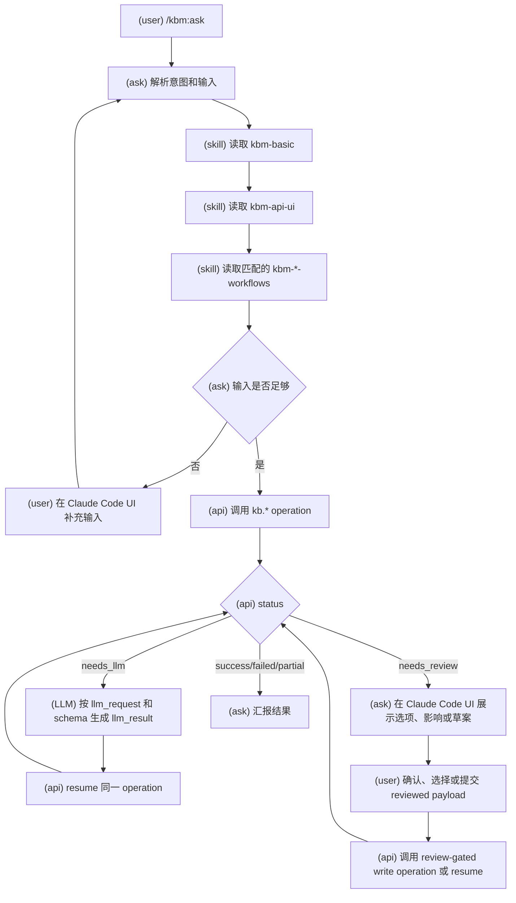
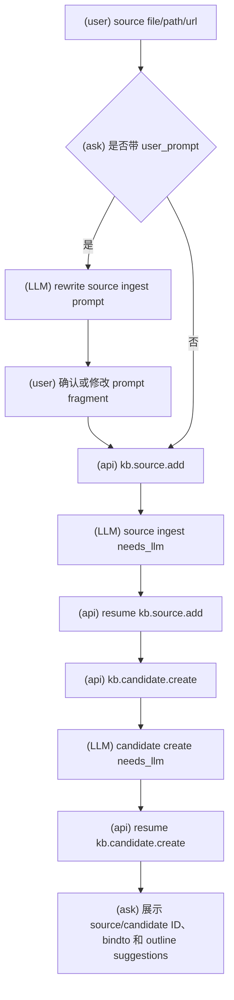
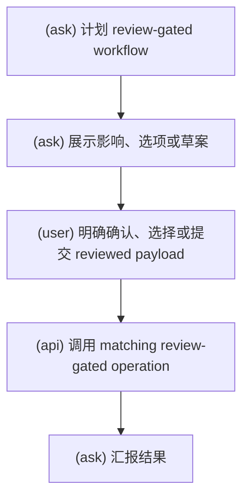
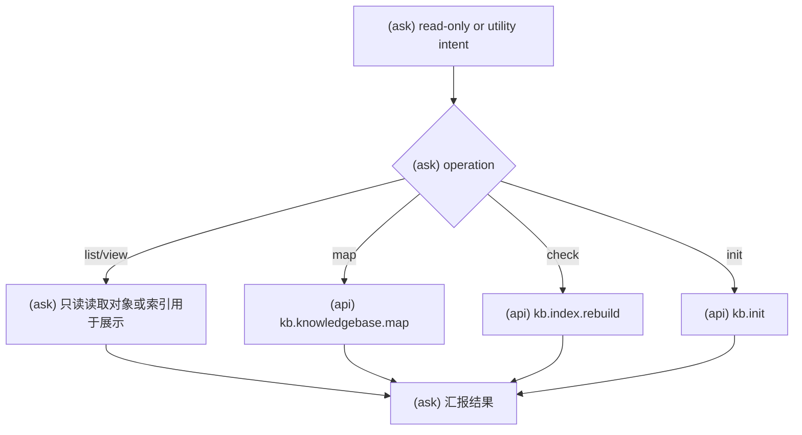

# 单入口流程图

本文描述 `/kbm:ask` 的第一层交互流程。流程只展开到调用第二层 `kb.*`
API 为止，不描述 API 内部读写细节。

标记含义：

- `(user)`：用户输入、回复、选择或确认。
- `(ask)`：`/kbm:ask` 编排。
- `(skill)`：`kbm-*` skill 提供的流程、规则或 API 参考。
- `(LLM)`：意图解析、`needs_llm` 输出生成、review assist 或结果整理。
- `(api)`：第二层 `kb.*` API 调用。

## 1. Claude Code UI 总流程

## 2. 旧 Slash Command 到 Skill 的映射

旧的细粒度 slash command 不再作为入口暴露，只作为 `/kbm:ask` 意图和 workflow skill 的历史流程来源。

| 旧流程 | 当前承载 |
| --- | --- |
| source add / source deprecate | `kbm-source` |
| candidate review | `kbm-candidate` |
| note add / note deprecate / note list / note view | `kbm-note` |
| knowledgebase create / knowledgebase list / knowledgebase map | `kbm-kb` |
| knowledgebase outline create / set-default / archive | `kbm-kb-outline` |
| init / check / clean | `kbm-maintenance` |

## 3. Source Add

## 4. Review-Gated Workflows

Review-gated workflows include source deprecate, candidate defer, knowledge
accept/reject/merge/deprecate, knowledgebase create, outline create/set-default/archive,
note deprecate, and clean migration execution.

## 5. Read-Only And Utility Workflows

Read-only display may use indexes for locating and displaying objects, but indexes
are not factual evidence and must not be written back into object facts.
