# Slash Command 流程图

本文描述第一层 slash command 的交互流程。流程只展开到调用第二层 `kb.*` API 为止，不描述 API 内部读写细节。

标记含义：

- `(user)`：用户输入、回复、选择或确认。
- `(interface)`：Claude Code / slash command 编排；review 草案和用户补充内容都通过 Claude Code 交互。
- `(LLM)`：第一层用于意图解析、结果整理、问题展示或问答范围判断。
- `(api)`：第二层 `kb.*` API 调用。

## 流程影响审查

| Slash command | 结论 | 说明 |
| --- | --- | --- |
| `/candidate review [candidate-id]` | 修改 | 展示 evidence、`bindto` 和 outline 修改建议；accept/merge 的 reviewed payload 包含 evidence，不自动改 outline。 |
| `/check` | 修改 | 展示 `bindto` 和 outline 节点一致性问题。 |
| `/clean` | 修改 | 特许迁移命令；完整计划经用户整批确认后才允许直接改新设计内的 schema 或目录 drift。 |
| `/init` | 不改主流程 | 初始化流程不受模型变化影响。 |
| `/knowledgebase create <path-or-url>` | 修改 | 创建最小 knowledgebase 后立即从 source-like input 生成 create 阶段字段，但不创建 source。 |
| `/knowledgebase list` | 字段同步 | 只读流程不变，展示内容随索引包含 `scope/outline`。 |
| `/knowledgebase map [knowledgebase-id]` | 修改 | 基于 `outline + bindto`，不再基于 knowledge 层级关系。 |
| `/lark server start/status/stop` | 不改主流程 | server 生命周期不受知识模型变化影响。 |
| `/note add/list/view/deprecate` | 不改主流程 | note 操作流程不受知识模型变化影响。 |
| `/source add <path>` | 修改 | candidate create 阶段先读 knowledgebase 定义，再生成 candidate。 |
| `/source deprecate <source-id>` | 不改主流程 | source 废弃流程不受模型变化影响。 |

## 1. `/candidate review [candidate-id]`

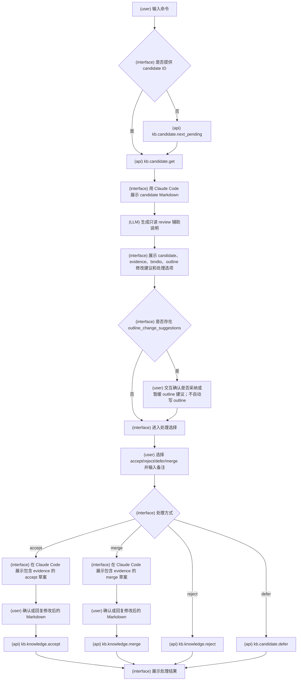

## 2. `/check`

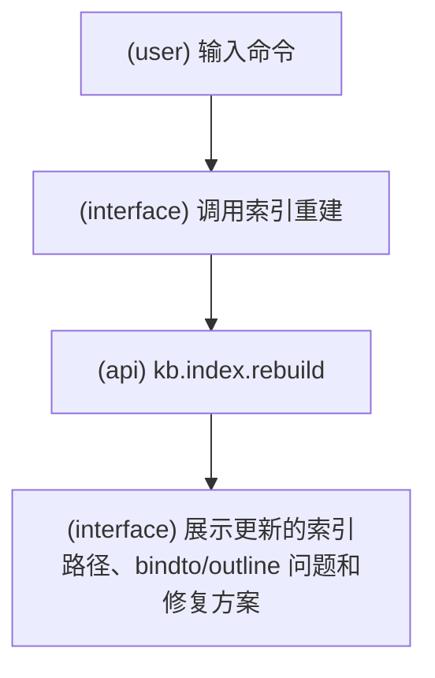

## 3. `/clean`

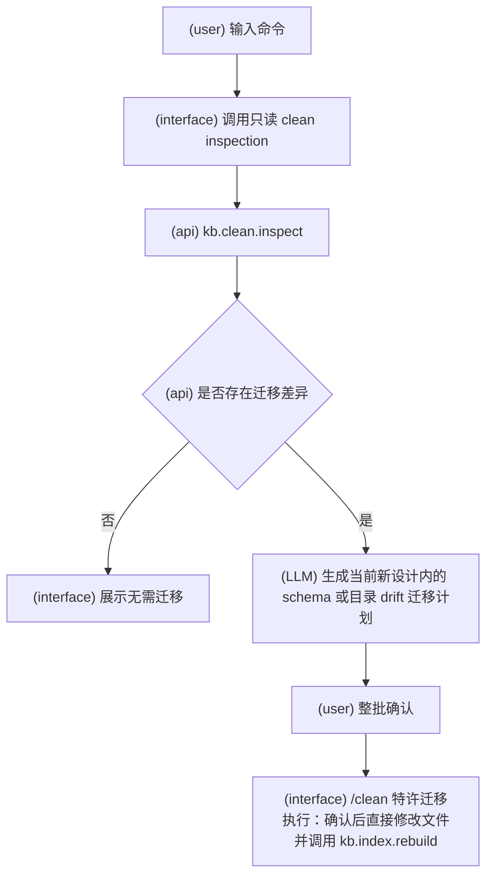

## 4. `/init`

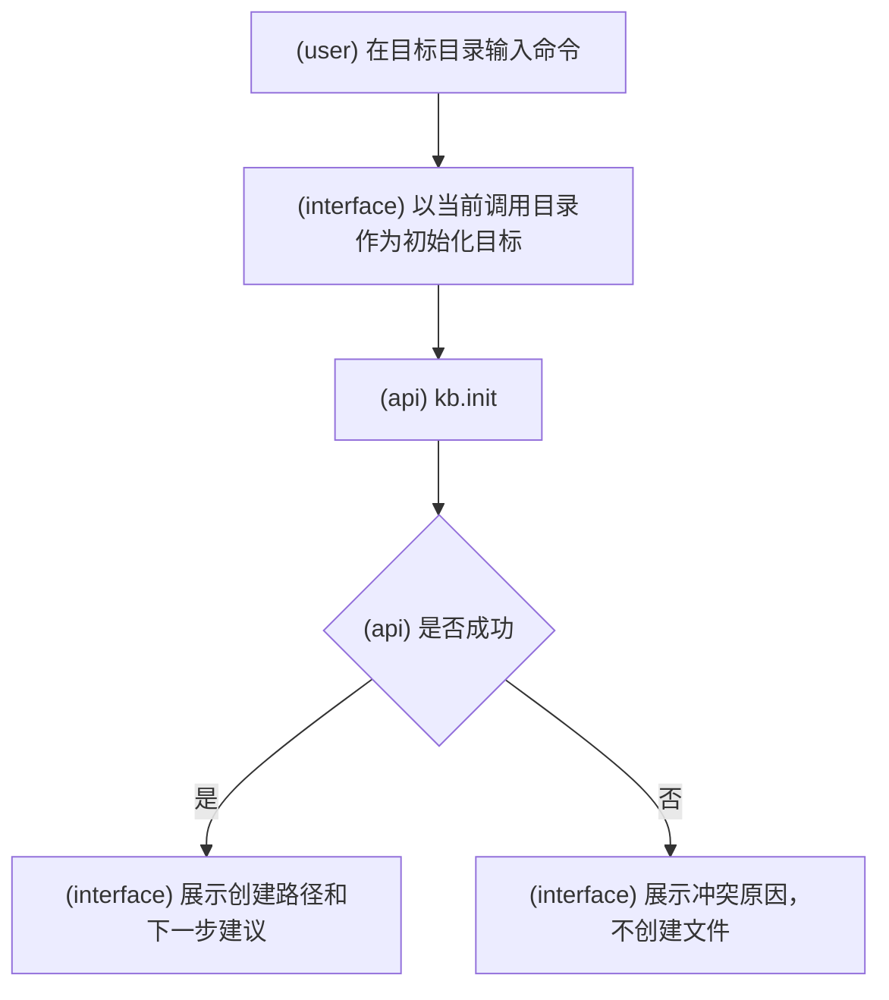

## 5. `/knowledgebase create <path-or-url>`

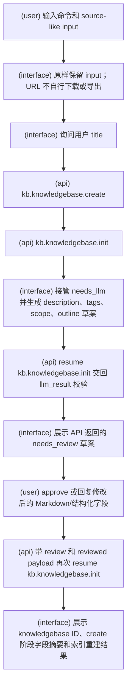

## 6. `/knowledgebase list`

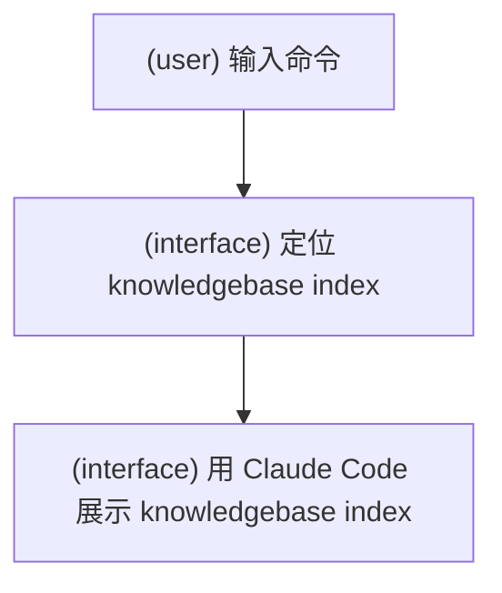

## 7. `/knowledgebase map [knowledgebase-id]`

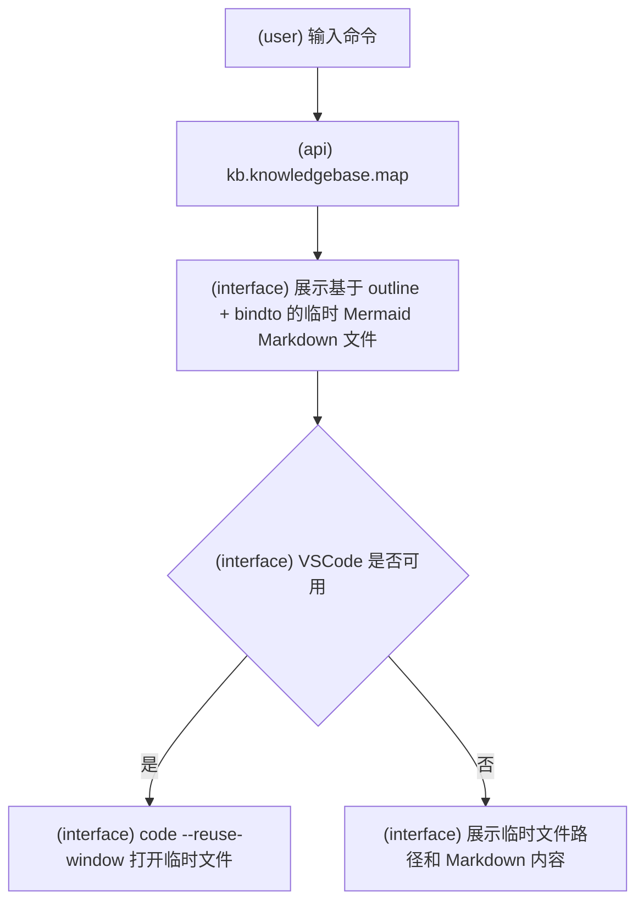

## 8. `/knowledgebase outline archive [knowledgebase-id] [outline-id]`

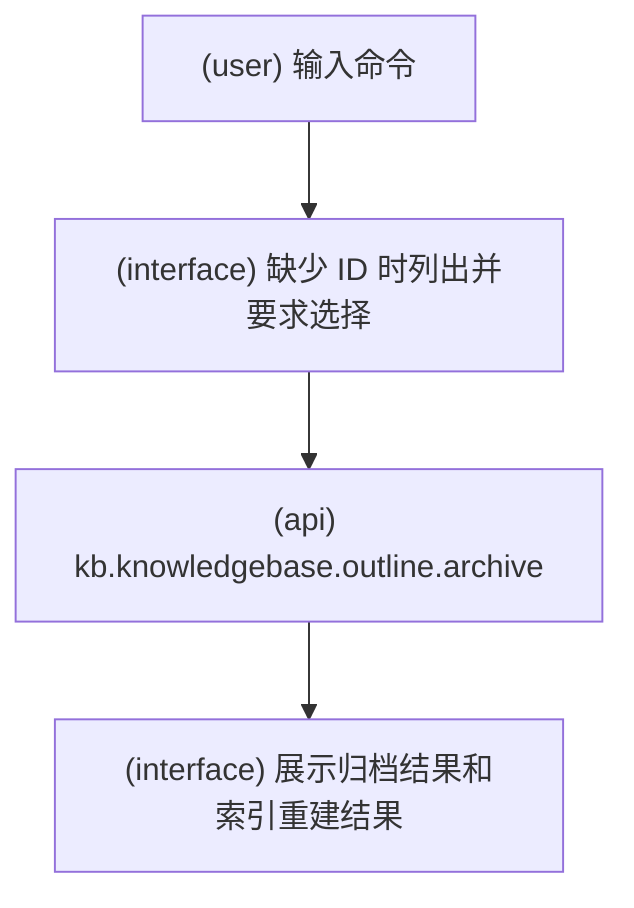

## 9. `/knowledgebase outline create [knowledgebase-id] <path-or-url>`

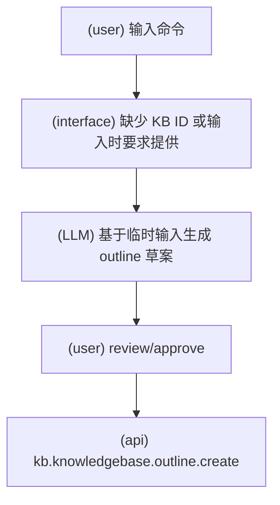

## 10. `/knowledgebase outline set-default [knowledgebase-id] [outline-id]`

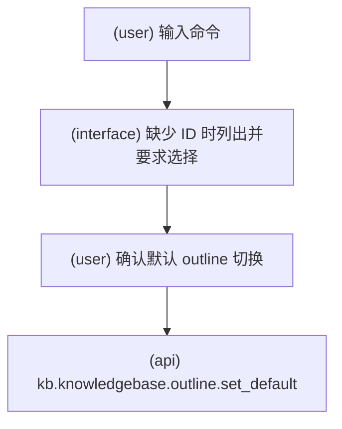

## 8. `/lark server start`

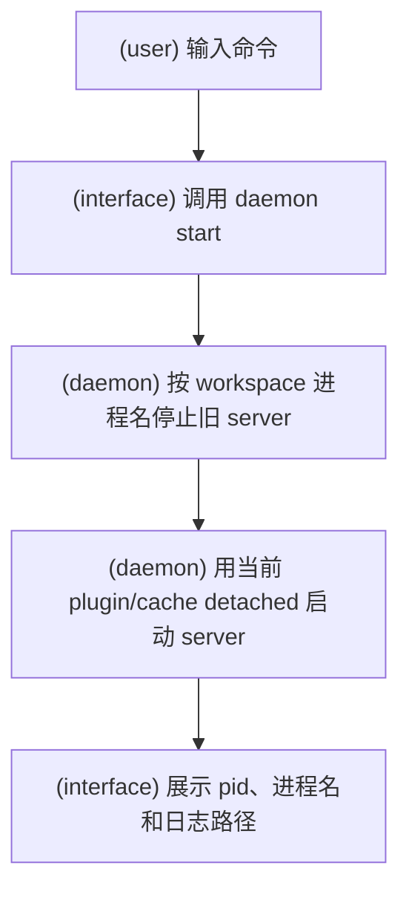

## 9. `/lark server status`

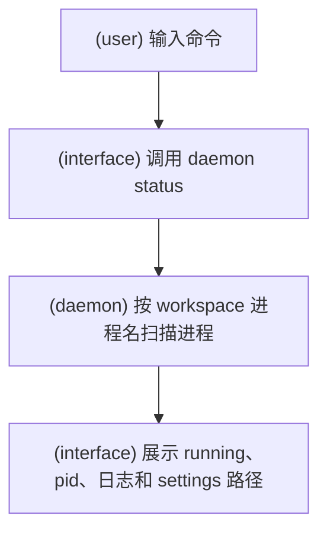

## 10. `/lark server stop`

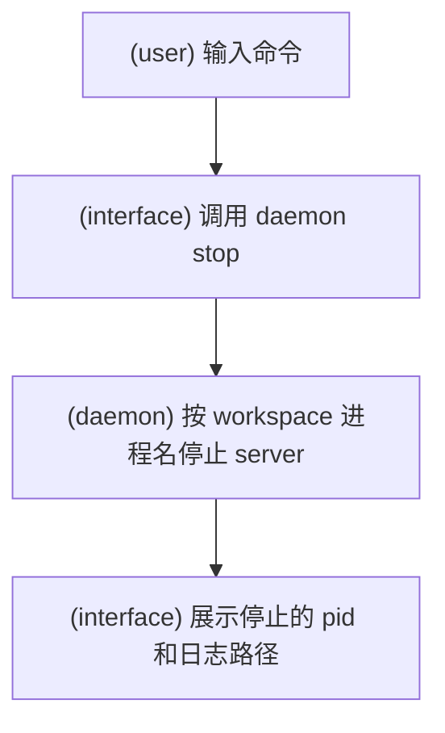

## 11. `/note add`

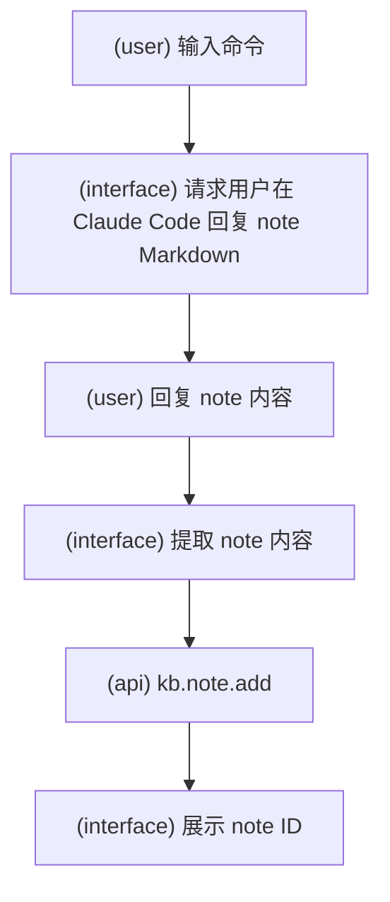

## 12. `/note deprecate <note-id>`

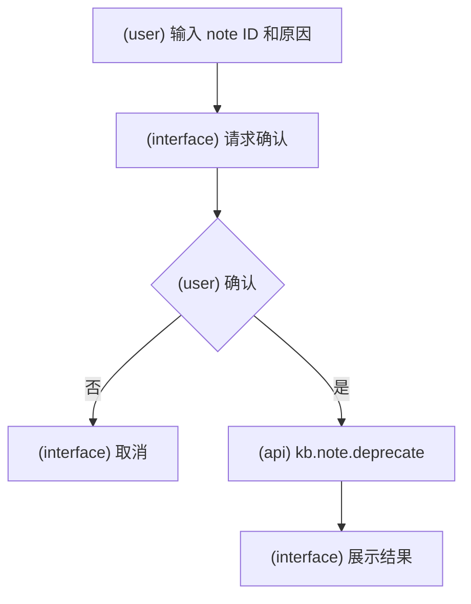

## 13. `/note list`

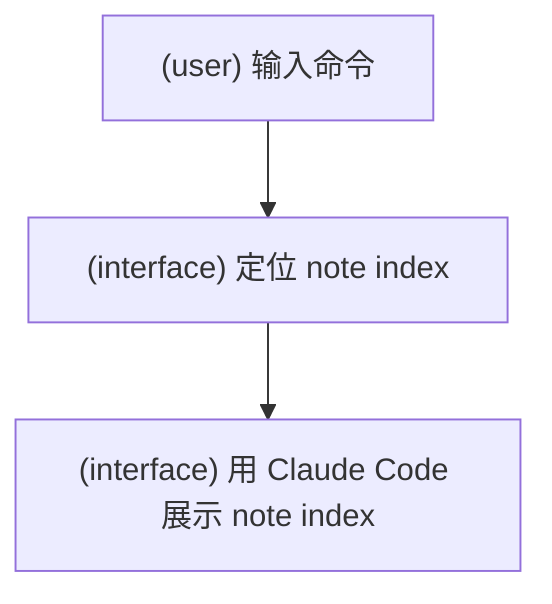

## 14. `/note view <note-id>`

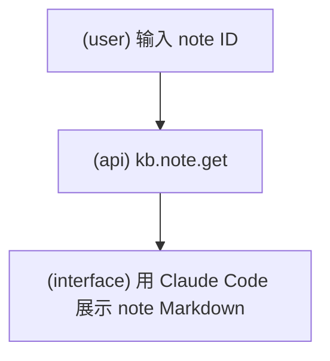

## 15. `/source add <path>`

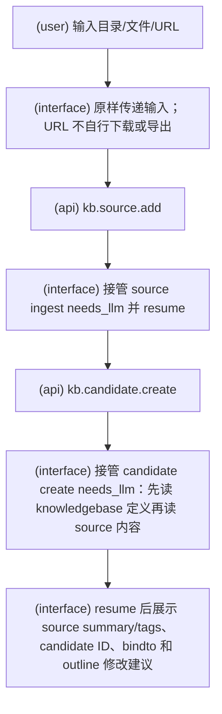

## 16. `/source deprecate <source-id>`

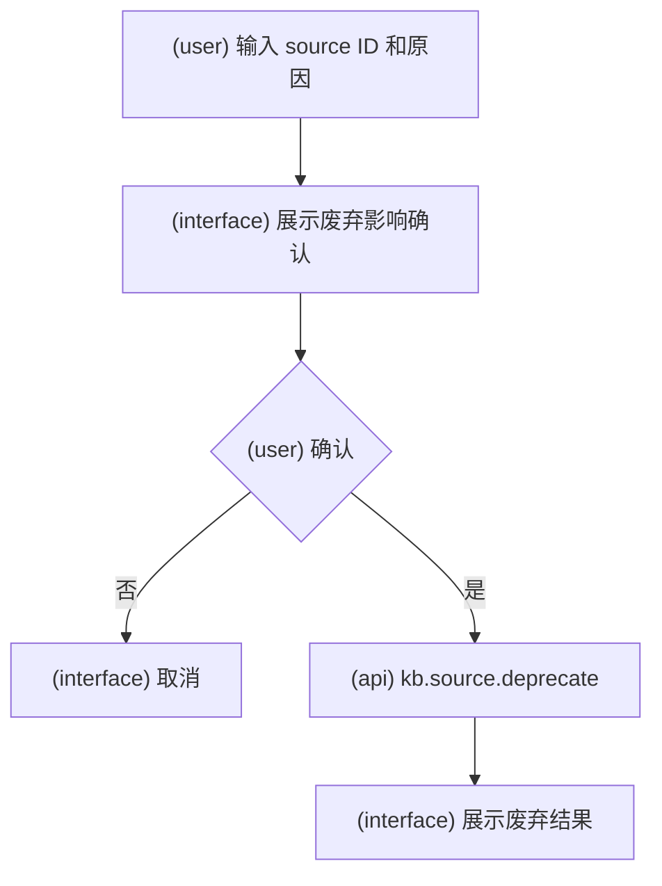
