# Slash Command 流程图

本文描述第一层 slash command 的交互流程。流程只展开到调用第二层 `kb.*` API 为止，不描述 API 内部读写细节。

标记含义：

- `(user)`：用户输入、回复、选择或确认。
- `(interface)`：Claude Code / slash command 编排；review 草案和用户补充内容都通过 Claude Code 交互。
- `(LLM)`：第一层用于意图解析、结果整理、问题展示或问答范围判断。
- `(api)`：第二层 `kb.*` API 调用。
## 1. `/candidate review [candidate-id]`

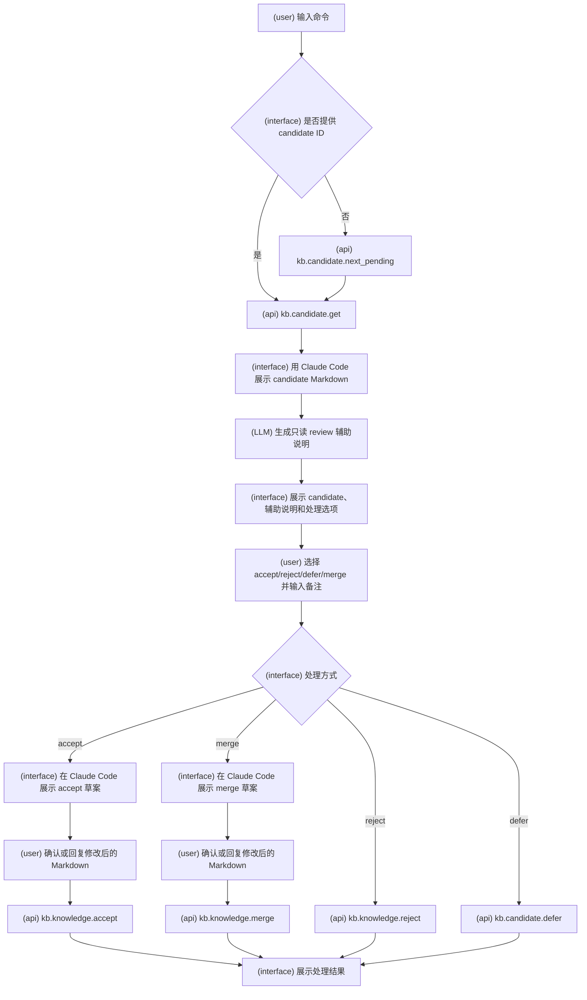

## 2. `/check`

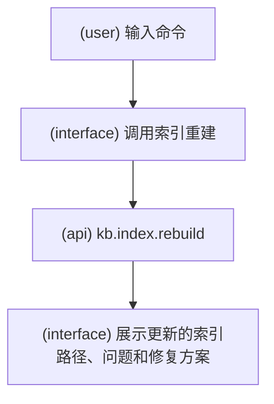

## 3. `/init`

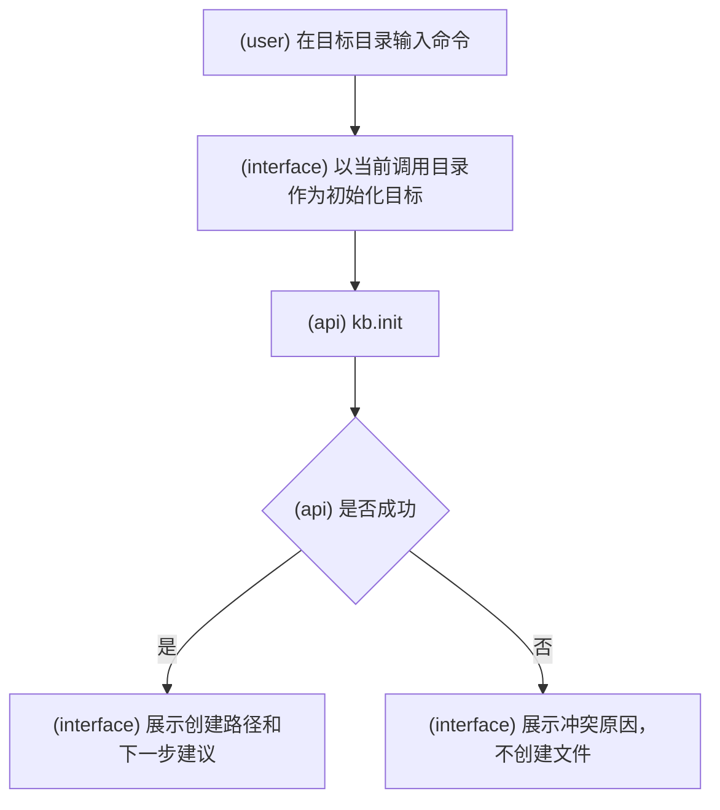

## 4. `/knowledgebase create`

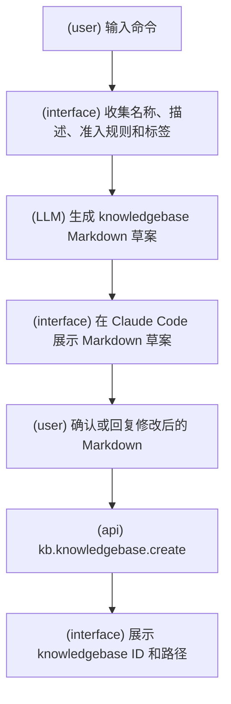

## 5. `/knowledgebase list`

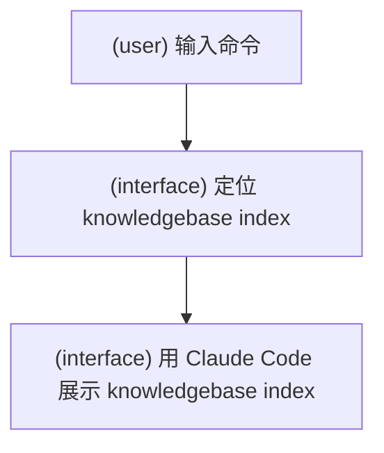

## 6. `/lark server start`

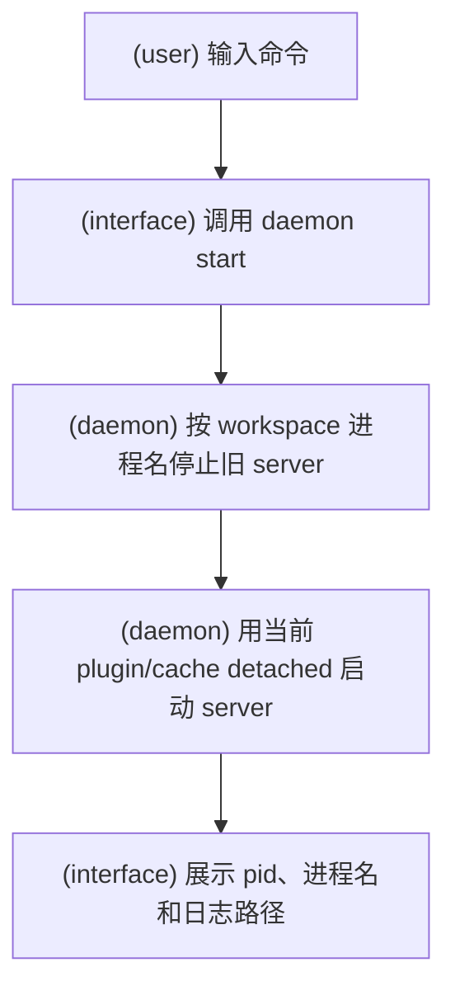

## 7. `/lark server status`

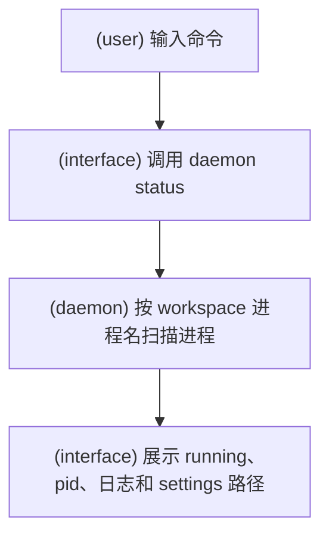

## 8. `/lark server stop`

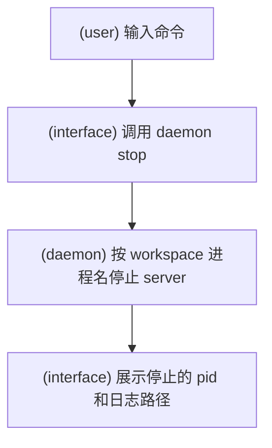

## 9. `/note add`

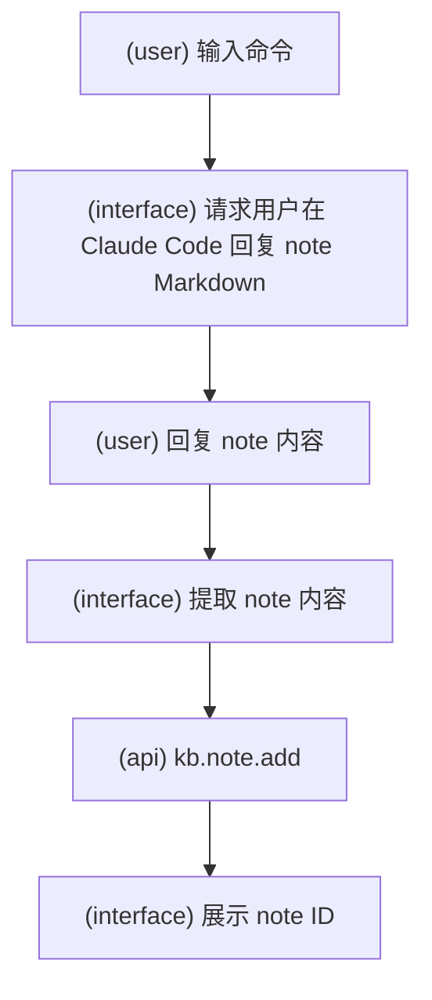

## 10. `/note deprecate <note-id>`

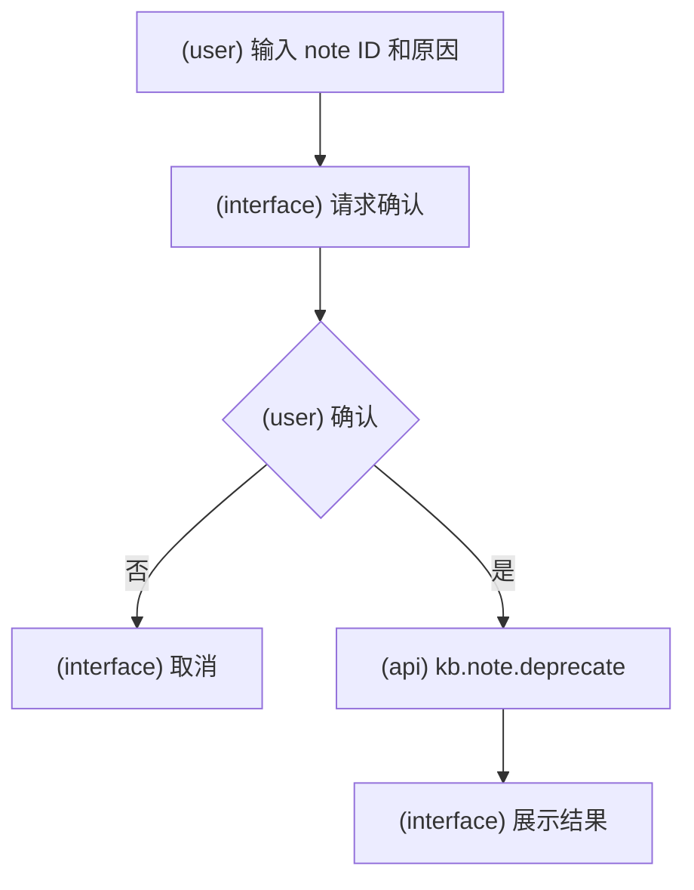

## 11. `/note list`

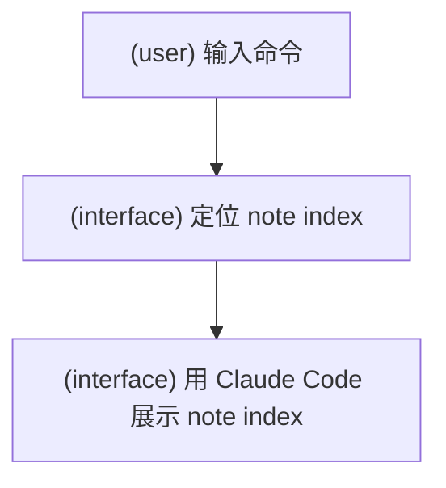

## 12. `/note view <note-id>`

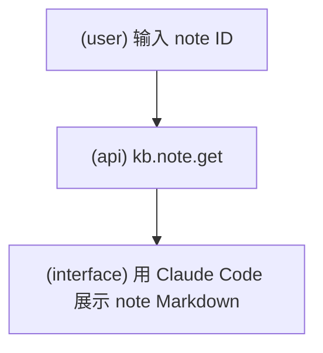

## 13. `/source add <path>`

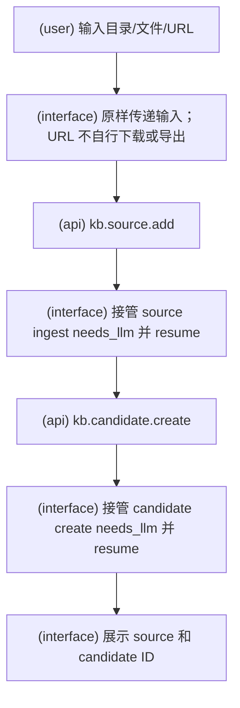

## 14. `/source deprecate <source-id>`

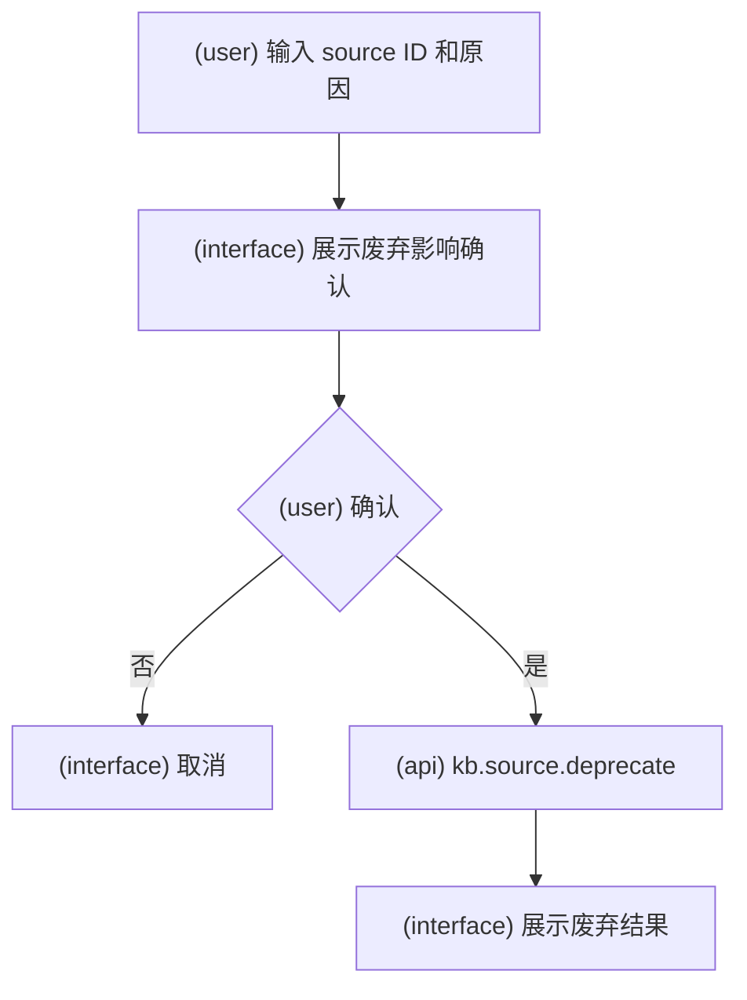
