# API 流程图

本文只描述第二层 `kb.*` API 流程。Slash command 的交互流程见 `docs/SlashCommand流程图.md`。

标记含义：

- `(api)`：第二层 Application API / Domain Service。
- `(data)`：第三层 Repository / Data Layer。
- `(LLM)`：由 Claude Code 接管的 LLM 调用。API 只返回 `needs_llm` 和 `llm_request`，不直接调用 LLM；用户侧不提供提示词文件。
- `(user)`：API 需要 user review 或确认时的外部决策输入。

## 1. `kb.init`

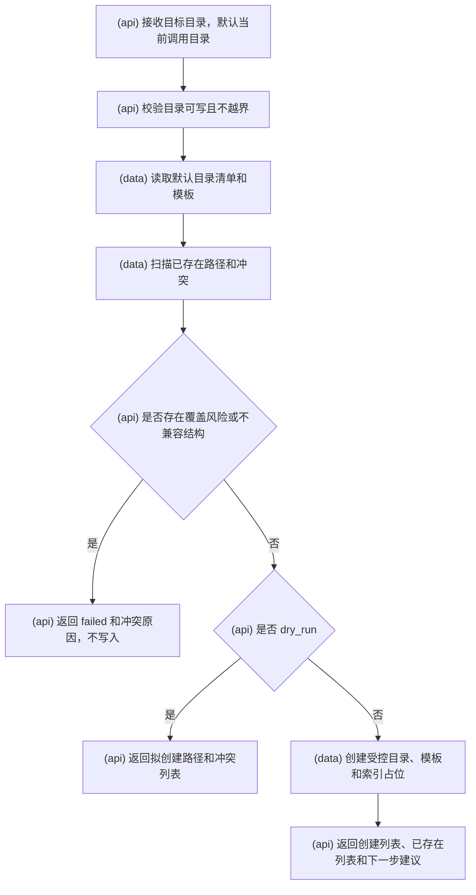

## 2. `kb.source.add`

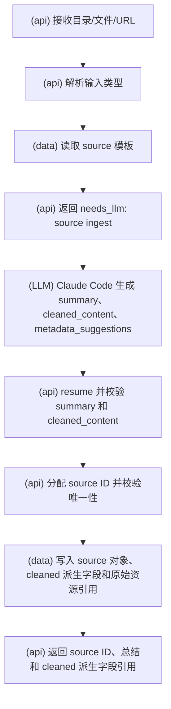

## 3. `kb.source.deprecate`

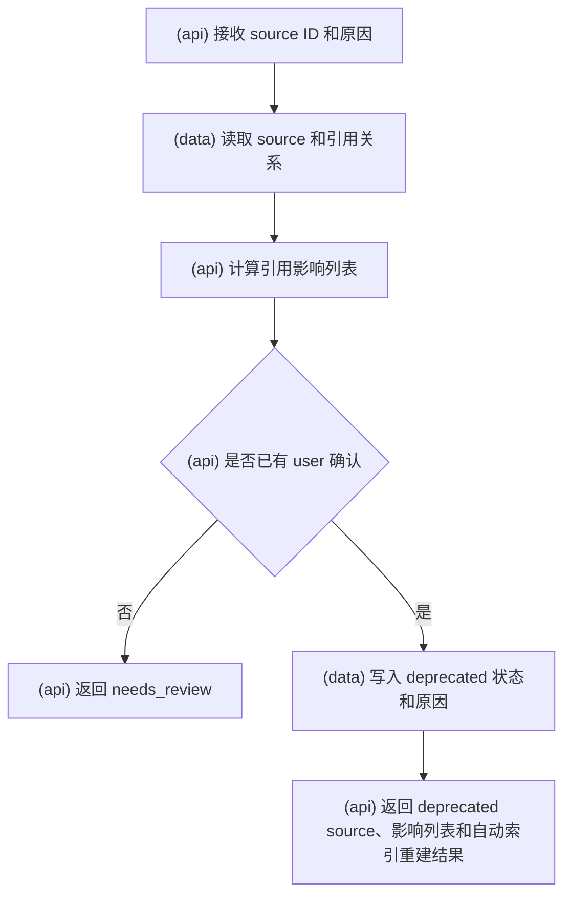

## 4. `kb.candidate.create`

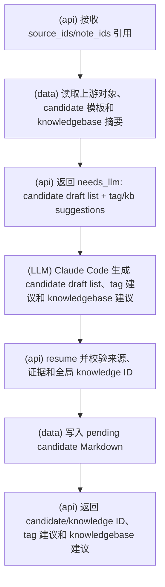

## 5. `kb.candidate.get`

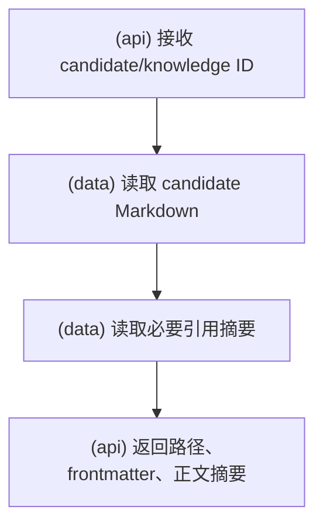

## 6. `kb.candidate.next_pending`

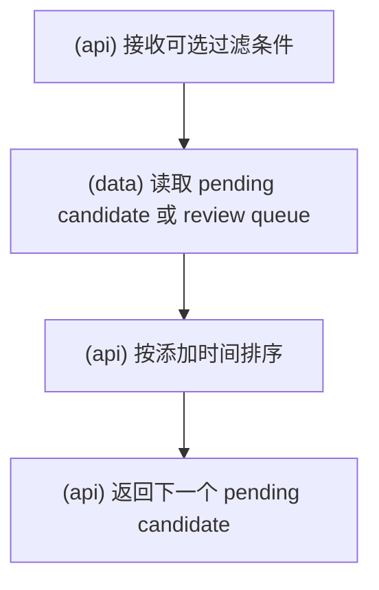

## 7. `kb.candidate.defer`

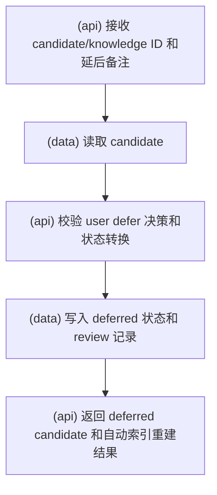

## 8. `kb.knowledge.accept`

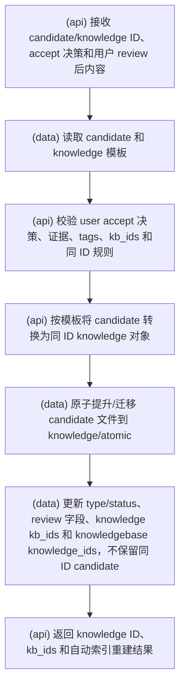

## 9. `kb.knowledge.merge`

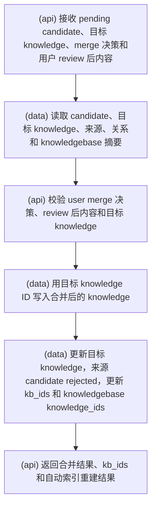

## 10. `kb.knowledge.reject`

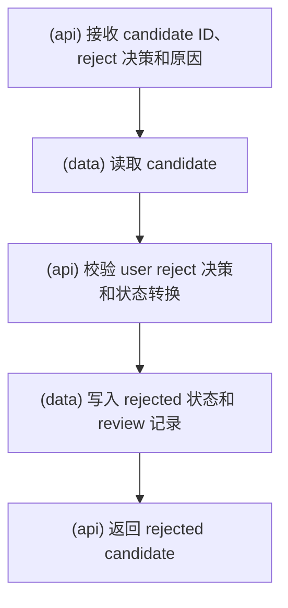

## 11. `kb.knowledge.deprecate`

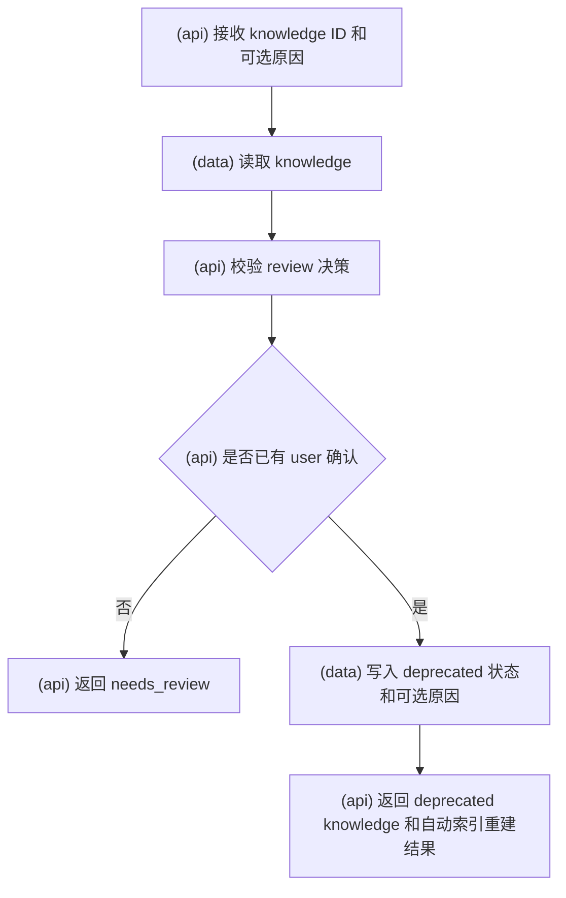

## 12. `kb.knowledgebase.create`

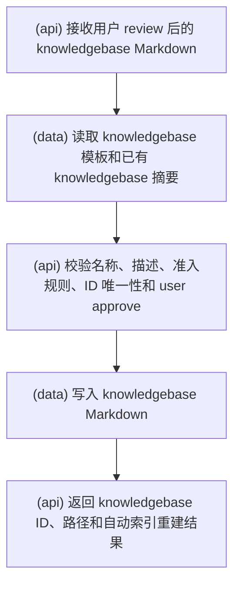

## 13. `kb.note.add`

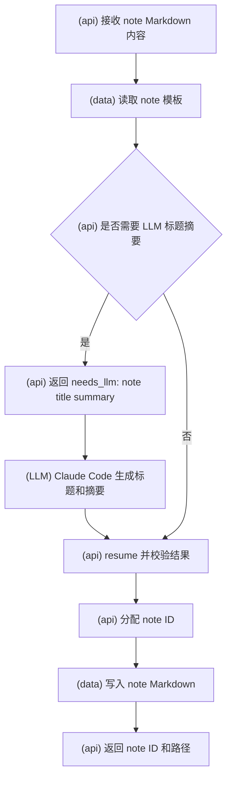

## 14. `kb.note.get`

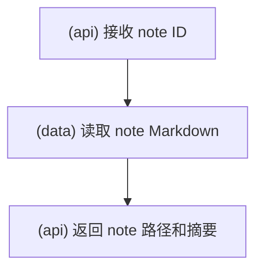

## 15. `kb.note.deprecate`

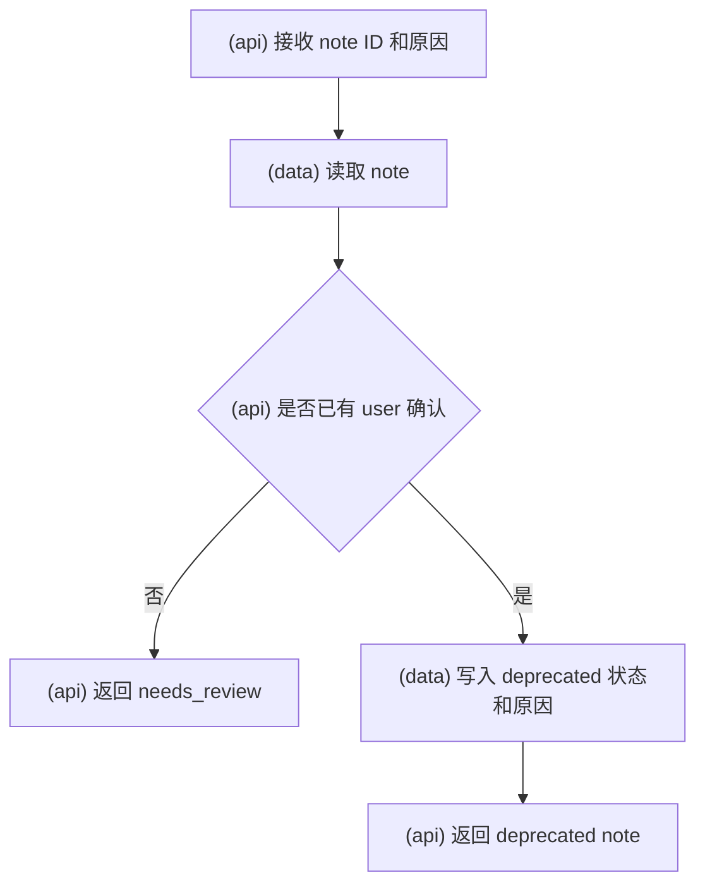

## 16. `kb.index.rebuild`

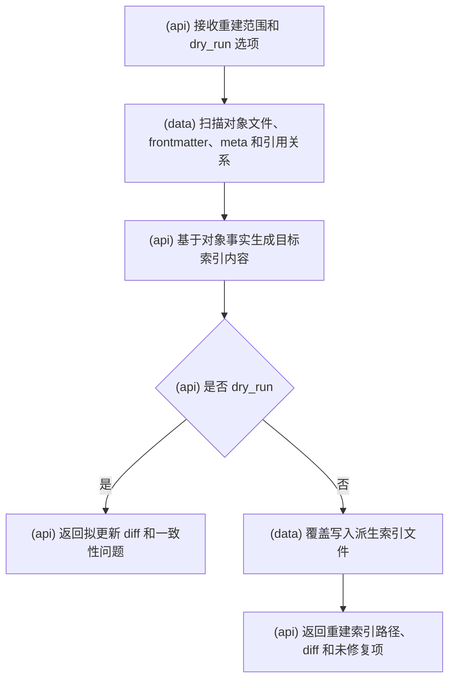
