# API 流程图

本文只描述第二层 `kb.*` API 流程。第一层交互与编排边界见 `docs/Interface.md`。

标记含义：

- `(api)`：第二层 Application API / Domain Service。
- `(data)`：第三层 Repository / Data Layer。
- `(LLM)`：由 Claude Code 接管的 LLM 调用。API 只返回 `needs_llm` 和 `llm_request`，不直接调用 LLM；用户侧不提供提示词文件。
- `(hook)`：Claude Code PreToolUse hook 在最终写入 helper 调用执行前请求用户审批。

## 流程影响审查

| API | 结论 | 说明 |
| --- | --- | --- |
| `kb.init` | 不改主流程 | 初始化目录和模板占位，不涉及新知识模型的运行流程。 |
| `kb.source.add` | 修改 | source ingest 只创建独立 source，初始状态为 `raw`。 |
| `kb.source.deprecate` | 不改主流程 | 废弃 source 的 review gate 不受模型变化影响。 |
| `kb.candidate.create` | 修改 | 输入为已有 source IDs；需要读取 knowledgebase `description/scope/outlines`，生成 `bindto` 和 outline 修改建议，并同步 source `linked` 状态。 |
| `kb.candidate.get` | 字段同步 | 读取流程不变，返回内容包含 `summary/content/bindto/outline_change_suggestions`。 |
| `kb.candidate.next_pending` | 不改主流程 | 排队逻辑不受字段变化影响。 |
| `kb.candidate.defer` | 不改主流程 | 状态转换由 PreToolUse hook 审批后执行。 |
| `kb.knowledge.accept` | 修改 | reviewed payload 改为 `summary/content/evidence/bindto`，不修改 outline。 |
| `kb.knowledge.merge` | 修改 | 合并 payload 改为 `summary/content/evidence/bindto`，不修改 outline。 |
| `kb.knowledge.reject` | 不改主流程 | 拒绝 candidate 由 PreToolUse hook 审批后执行，不依赖新字段。 |
| `kb.knowledge.deprecate` | 不改主流程 | 废弃 knowledge 的状态流转不变。 |
| `kb.knowledgebase.create` | 修改 | 草案由 `kb.knowledgebase.create.prepare` / `revise` 生成；最终 API 接收经用户 review 的完整 payload 并由 PreToolUse hook 审批后写入。 |
| `kb.knowledgebase.outline.create` | 新增 | 追加经 review 的新 outline，并更新 manifest。 |
| `kb.knowledgebase.outline.set_default` | 新增 | 切换 active knowledgebase 的默认 outline。 |
| `kb.knowledgebase.outline.archive` | 新增 | 归档非默认 outline，并检查已有绑定影响。 |
| `kb.knowledgebase.map` | 修改 | 使用默认 outline + `bindto` 结构图。 |
| `kb.note.add` | 不改主流程 | note 写入流程不受知识模型变化影响。 |
| `kb.note.get` | 不改主流程 | note 读取流程不受知识模型变化影响。 |
| `kb.note.deprecate` | 不改主流程 | note 废弃流程由 PreToolUse hook 审批后执行。 |
| `kb.index.rebuild` | 修改 | 增加 `bindto`、outline 节点和 source `raw/linked` 状态一致性检查。 |

## 1. `kb.init`

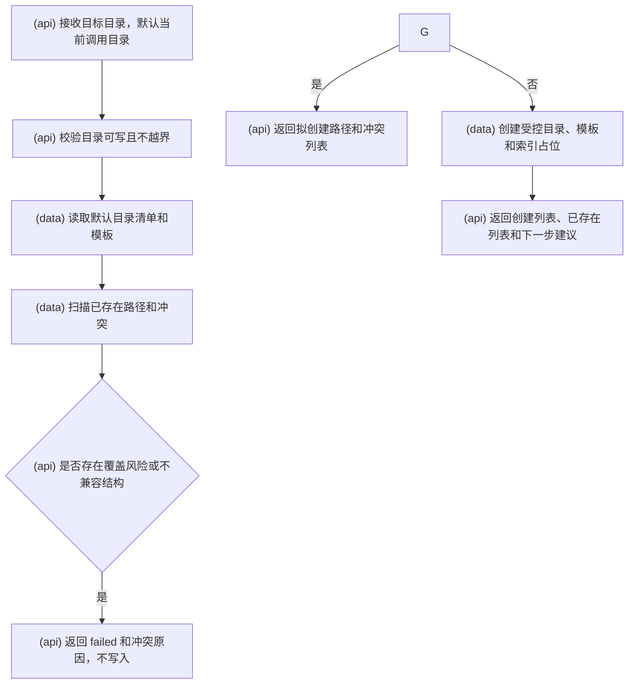

## 2. `kb.source.add`

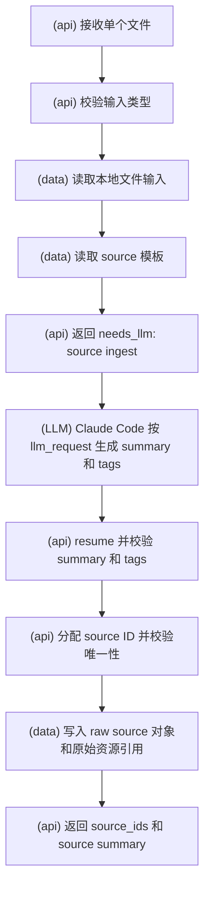

## 3. `kb.source.deprecate`

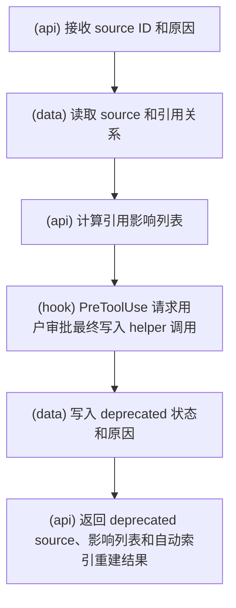

## 4. `kb.candidate.create`

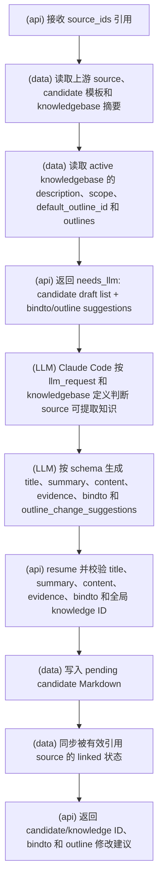

## 5. `kb.candidate.get`

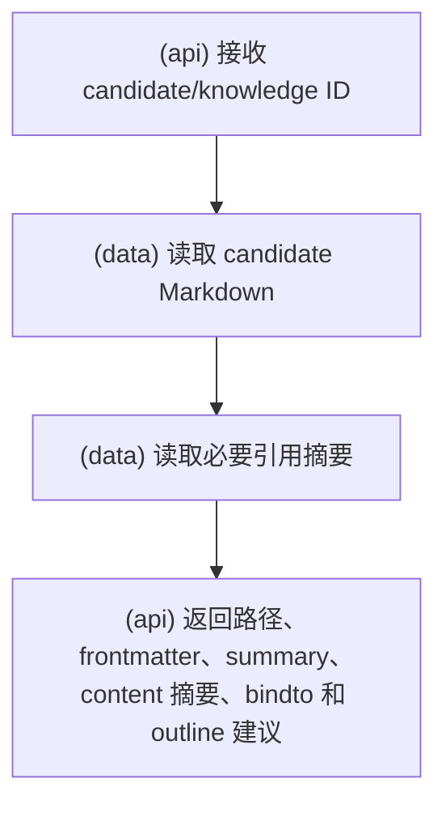

## 6. `kb.candidate.next_pending`

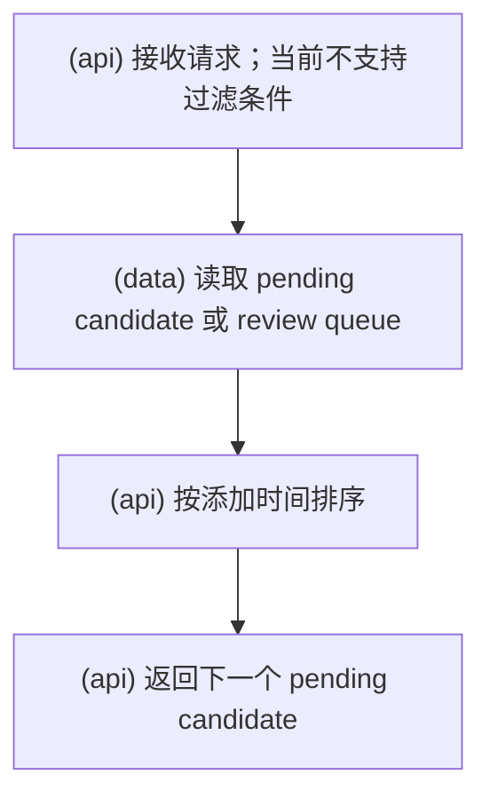

## 7. `kb.candidate.defer`

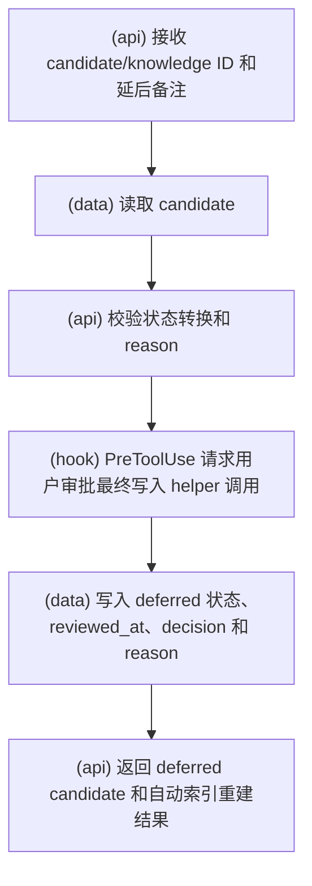

## 8. `kb.knowledge.accept`

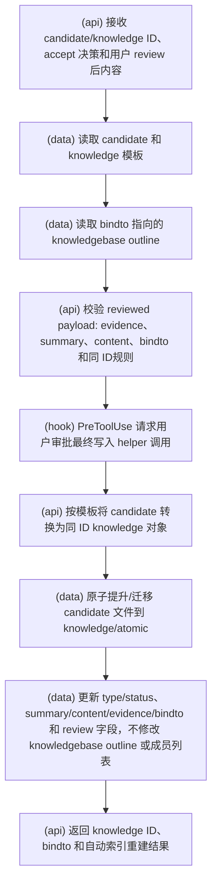

## 9. `kb.knowledge.merge`

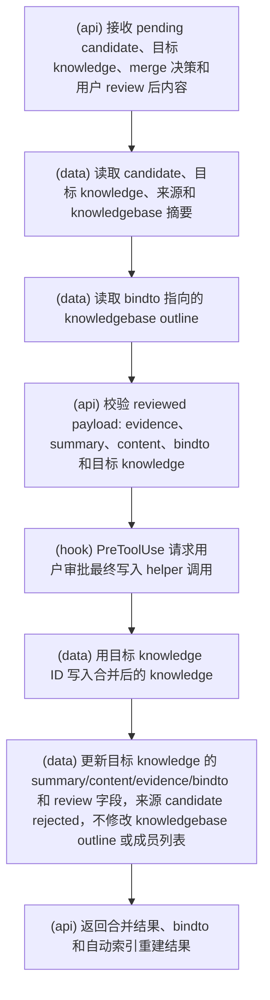

## 10. `kb.knowledge.reject`

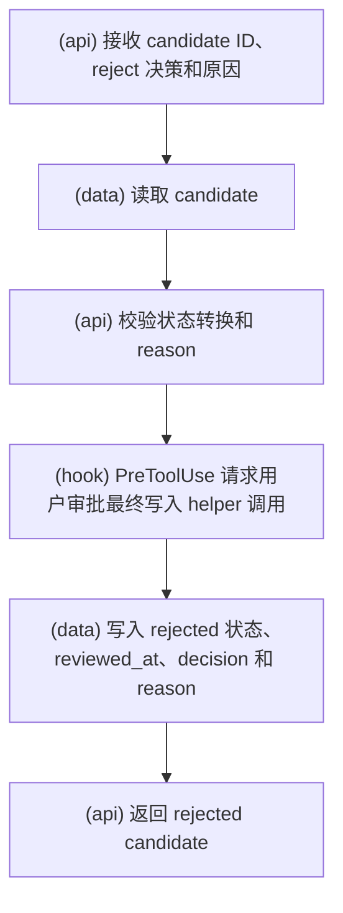

## 11. `kb.knowledge.deprecate`

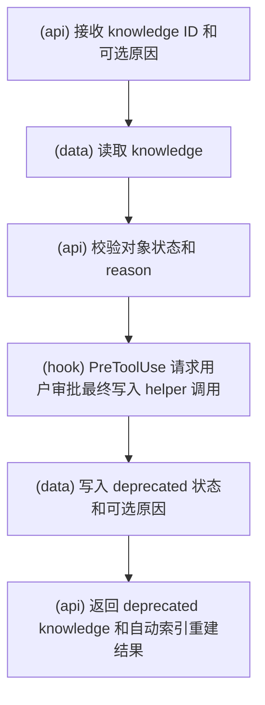

## 12. `kb.knowledgebase.create`

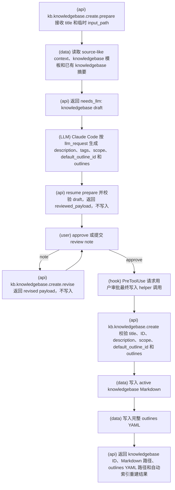

## 13. `kb.knowledgebase.outline.create`

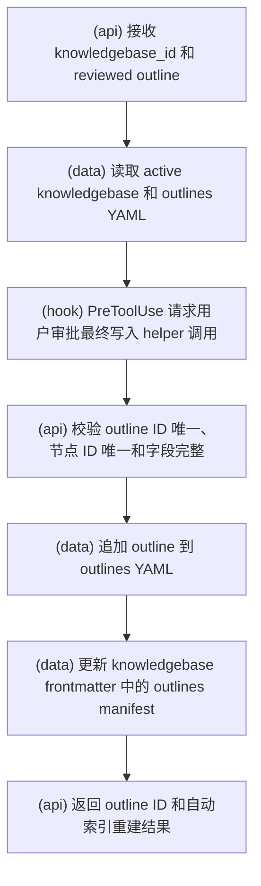

## 14. `kb.knowledgebase.outline.set_default`

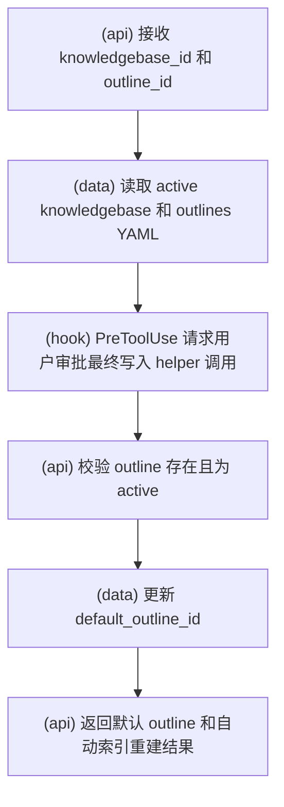

## 15. `kb.knowledgebase.outline.archive`

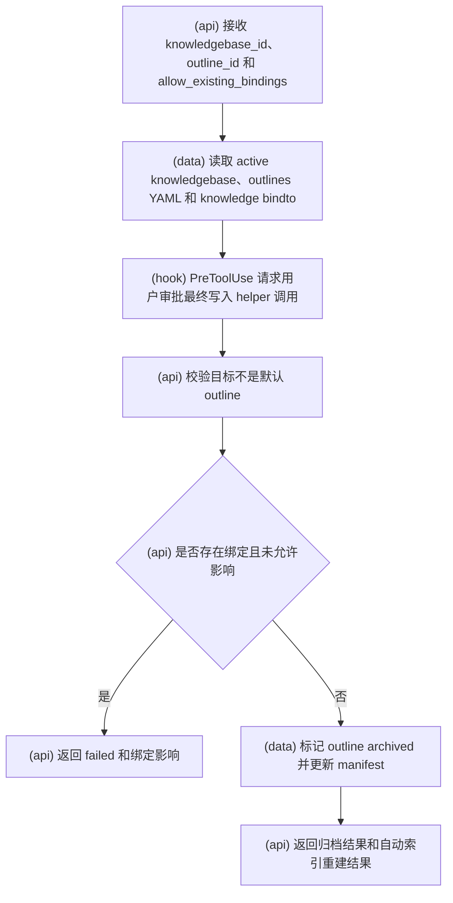

## 16. `kb.knowledgebase.map`

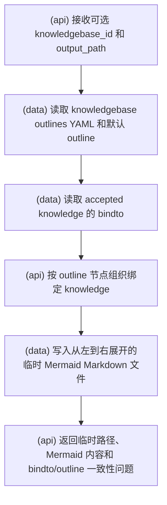

## 17. `kb.note.add`

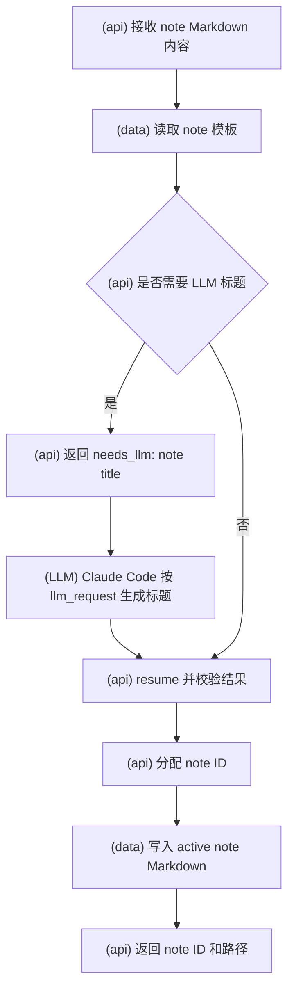

## 18. `kb.note.get`

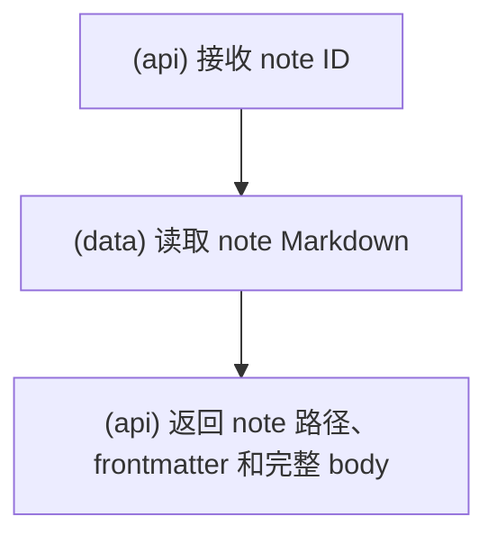

## 19. `kb.note.deprecate`

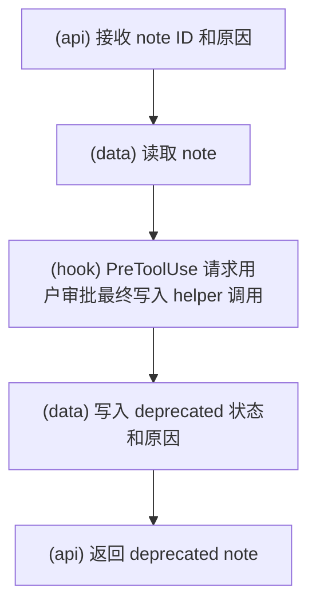

## 20. `kb.index.rebuild`

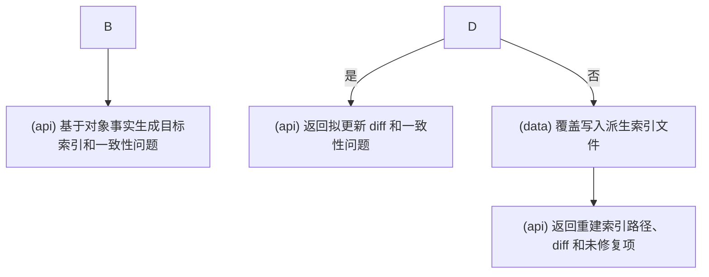
