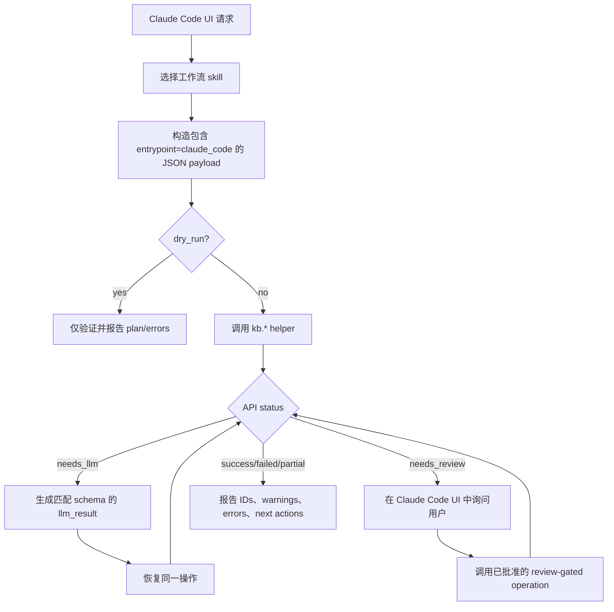

# KBManager API UI

使用此 skill 时，必须明确告诉用户：`Using skill: kbm-api-ui`。

从 Claude Code UI 调用 `scripts/kbmanager_plugin.py` 前，或记录 UI 可调用的
KBManager 操作时，使用此 skill。

## 辅助脚本契约

```bash
python3 "${CLAUDE_PLUGIN_ROOT}/scripts/kbmanager_plugin.py" <kb.operation> '<payload-json>' --pretty
```

- Payload 是 JSON object。
- Result 是内部 API result model 产生的 JSON object。
- 每个 payload 必须包含 `entrypoint: "claude_code"`。
- 每个 payload 必须包含 `dry_run`。在不执行写入、移动或 LLM resume 的情况下验证时，
  使用 `dry_run: true`。
- 如果 API 返回 `needs_llm`，使用其 `llm_request`，匹配其 schema，并用返回的 token
  恢复同一操作。
- 如果 API 返回 `needs_review`，在 Claude Code UI 中暂停，直到用户 approve、edit
  或 reject proposed action。

## UI 能力边界

只要遵守参数、review gates 和 dry-run 行为，Claude Code UI 可以调用所有已文档化的
`kb.*` 操作。

## 流程



## 参考

- `references/api-ui-catalog.md`
- `references/api-ui-flowcharts.md`
- `docs/API设计.md`
- `docs/Interface.md`
