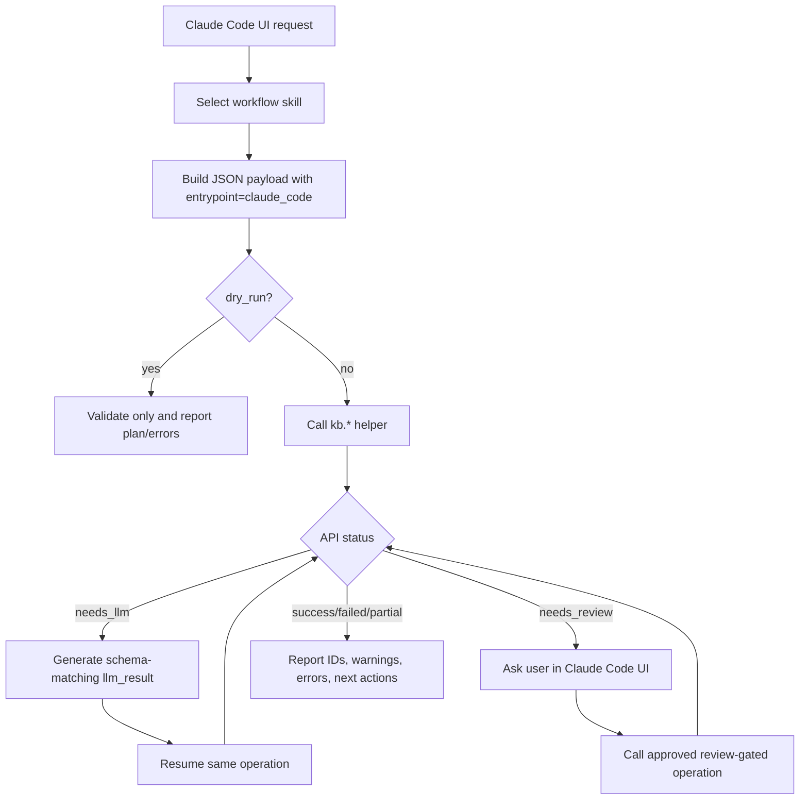

# KBManager API UI

Use this skill before invoking `scripts/kbmanager_plugin.py` from Claude Code UI
or documenting UI-callable KBManager operations.

## Helper Contract

```bash
python3 "${CLAUDE_PLUGIN_ROOT}/scripts/kbmanager_plugin.py" <kb.operation> '<payload-json>' --pretty
```

- Payloads are JSON objects.
- Results are JSON objects produced by the internal API result model.
- Every payload must include `entrypoint: "claude_code"`.
- Every payload must include `dry_run`. Use `dry_run: true` when validating
  without writes, moves, or LLM resume.
- If an API returns `needs_llm`, use its `llm_request`, match its schema, and
  resume the same operation with the returned token.
- If an API returns `needs_review`, pause in Claude Code UI until the user
  approves, edits, or rejects the proposed action.

## UI Capability Boundary

Claude Code UI may call all documented `kb.*` operations when their parameters,
review gates, and dry-run behavior are respected.

## Flow



## References

- `references/api-ui-catalog.md`
- `references/api-ui-flowcharts.md`
- `docs/API设计.md`
- `docs/Interface.md`
