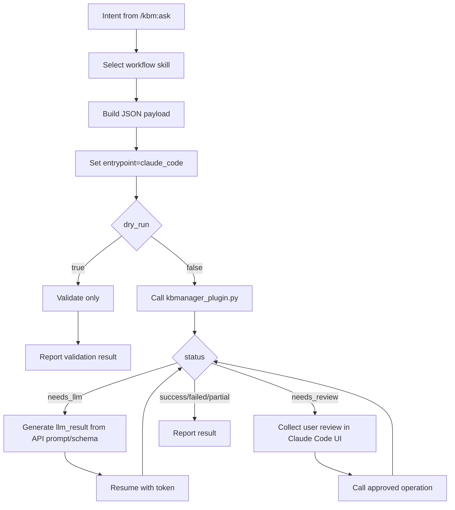

# KBManager UI API Flowcharts

## Standard API Call

```mermaid
flowchart TD
  A["Intent from /kbm:ask"] --> B["Select workflow skill"]
  B --> C["Build JSON payload"]
  C --> D["Set entrypoint=claude_code"]
  D --> E{"dry_run"}
  E -- true --> F["Validate only"]
  E -- false --> G["Call kbmanager_plugin.py"]
  F --> H["Report validation result"]
  G --> I{"status"}
  I -- needs_llm --> J["Generate llm_result from API prompt/schema"]
  J --> K["Resume with token"]
  K --> I
  I -- needs_review --> L["Collect user review in Claude Code UI"]
  L --> M["Call approved operation"]
  M --> I
  I -- success/failed/partial --> N["Report result"]
```

