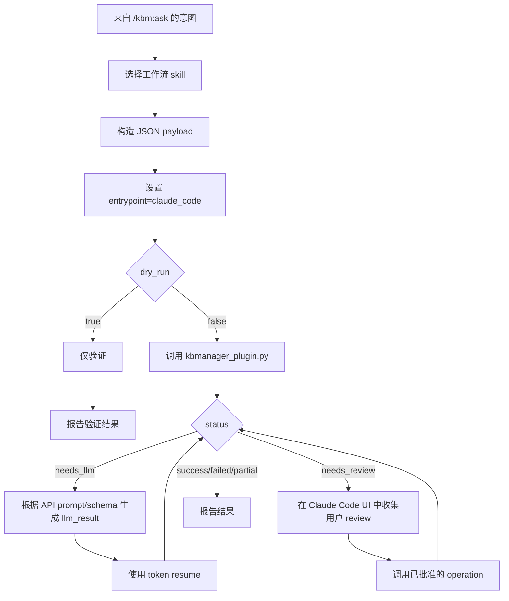

# KBManager UI API 流程图

## 标准 API 调用

```mermaid
flowchart TD
  A["来自 /kbm:ask 的意图"] --> B["选择工作流 skill"]
  B --> C["构造 JSON payload"]
  C --> D["设置 entrypoint=claude_code"]
  D --> E{"dry_run"}
  E -- true --> F["仅验证"]
  E -- false --> G["调用 kbmanager_plugin.py"]
  F --> H["报告验证结果"]
  G --> I{"status"}
  I -- needs_llm --> J["根据 API prompt/schema 生成 llm_result"]
  J --> K["使用 token resume"]
  K --> I
  I -- needs_review --> L["在 Claude Code UI 中收集用户 review"]
  L --> M["调用已批准的 operation"]
  M --> I
  I -- success/failed/partial --> N["报告结果"]
```
