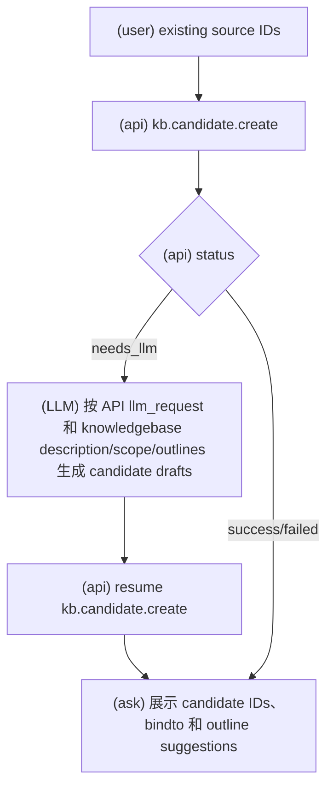
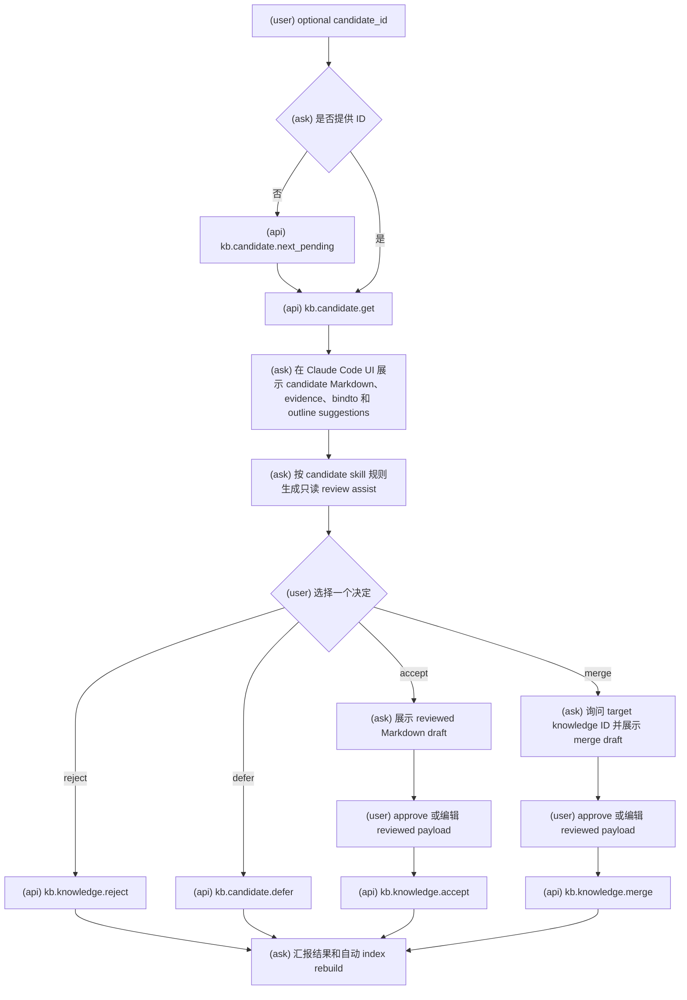
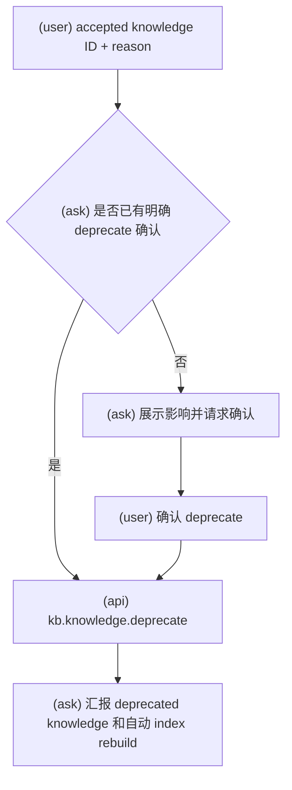

# KBManager Candidate And Knowledge Review Workflows

使用此 skill 时，必须明确告诉用户：`Using skill: kbm-candidate`。

执行此 skill 的任何工作流前，必须先阅读 `kbm-usage`。

此 skill 覆盖 candidate create/get/next pending/review，以及 accepted knowledge 的 merge/deprecate 等 review-gated 动作。

## Candidate Create

### 意图流程图

- 通常由 `kbm-source` 在 source add 成功后强制调用。
- 也可在用户明确要求从已有 source IDs 创建 candidates 时调用。
- API 返回 `needs_llm` 时，生成 API 请求的结构化 candidate draft list，并用同一 resume token 恢复。
- 只创建 pending candidates，不创建 accepted knowledge。
- 没有 review gate，但可能返回 deprecated source warnings。

## Candidate Review

当用户想要 accept、reject、defer、merge、approve、revise 或以其他方式 review pending candidate 时使用。

### 意图流程图

1. 获取 candidate，或使用 next pending。
2. 可选生成只读 review assistance；review assistance 不是用户批准。
3. 在 Claude Code UI 中展示 candidate content、summary、evidence、bindto suggestions、outline suggestions 和可选决定。
4. 收集明确用户决定，或收集用户编辑后的 reviewed payload。
5. 调用匹配的 review-gated API。
6. 报告 accepted、rejected、deferred 或 merged 的 IDs、updated paths、warnings 和 next actions。

## Candidate Get And Next Pending

- 对指定 candidate 使用 `kb.candidate.get`。
- 当用户要求“下一个”“继续审核”“next pending”“review queue”时，使用 `kb.candidate.next_pending`。
- 两者都是只读操作；展示 candidate content、summary、evidence、bindto、outline change suggestions 和 review state。
- 展示时不要把 index 内容当作事实；candidate object 是事实来源。

## Accept Candidate

- 使用 `kb.knowledge.accept`。
- 需要明确 `decision: "accept"`。
- 需要 reviewed title、summary、content、evidence 和 bindto。
- Evidence 必须来自 candidate 的 upstream source evidence。
- Bindto 必须引用存在的 knowledgebase、outline 和 node。
- 成功后 pending candidate 被 promote/move 为同 ID accepted knowledge；不要保留同 ID candidate。

## Reject Candidate

- 使用 `kb.knowledge.reject`。
- 需要明确 `decision: "reject"`，建议提供 reason。
- 成功后 candidate 移动到 rejected；不生成 accepted knowledge。

## Defer Candidate

- 使用 `kb.candidate.defer`。
- 需要明确 `decision: "defer"`，建议提供 reason。
- 成功后 candidate 移动到 deferred；后续可由人工或未来 workflow 重新处理。

## Merge Candidate Into Knowledge

- 使用 `kb.knowledge.merge`。
- 需要 pending candidate ID、accepted target knowledge ID、明确 `decision: "merge"`。
- 需要 reviewed summary、content、evidence 和 bindto。
- 不使用单独的 merge LLM 草案；缺少 reviewed merge payload 时，必须暂停并要求用户提交 reviewed summary、content、evidence 和 bindto。
- 成功后 target knowledge 更新，source candidate 以 rejected/merge decision 保留审计记录。
- Merge 结果使用 target knowledge ID，不使用 candidate ID 作为正式 knowledge ID。

## Review Assist Rules

- Review assist 是只读辅助，只能帮助用户检查 summary、evidence、bindto、outline suggestions、风险和不确定点。
- 不要修改 KBManager object files。
- 不要代表用户做 accept、reject、defer、merge 或 deprecate 决策。
- 不要把 LLM 或 ask 建议表述为用户批准。
- 不要引入 candidate 或其引用对象中没有 evidence 支持的新事实。
- Suggested `bindto` 只是建议；最终 `bindto` 必须来自用户 reviewed content。
- 如果 candidate 包含 `outline_change_suggestions`，只说明影响；不要修改 knowledgebase outline，也不要把 outline 修改呈现为已批准。

## Deprecate Accepted Knowledge

### 意图流程图

- 使用 `kb.knowledge.deprecate`。
- 需要 accepted knowledge ID、明确 `decision: "deprecate"` 和 reason。
- 不要删除 knowledge；deprecated knowledge 保留历史事实和引用链。
- 展示 deprecated knowledge 时明确标记过时或不推荐。

## Evidence And Bindto Rules

- Candidate 和 knowledge evidence 必须可追溯到 upstream source。
- Evidence item 必须包含 source/object ID、locator，以及 quote、excerpt 或 snippet。
- Notes、indexes、LLM suggestions 或用户未确认的草案不能作为 candidate evidence。
- `bindto` 表示 knowledge 归属和 outline node 绑定；没有合适绑定时使用空列表。
- `outline_change_suggestions` 只是建议，不自动修改 outline；需要 KB/outline workflow 单独处理。
