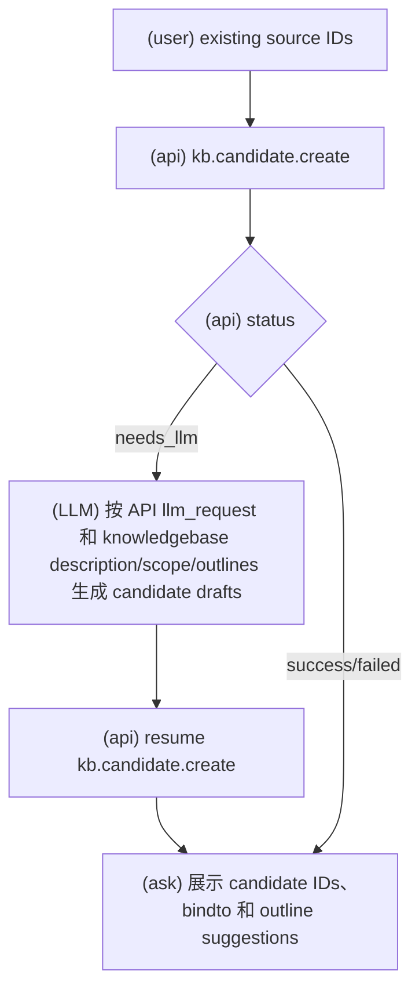
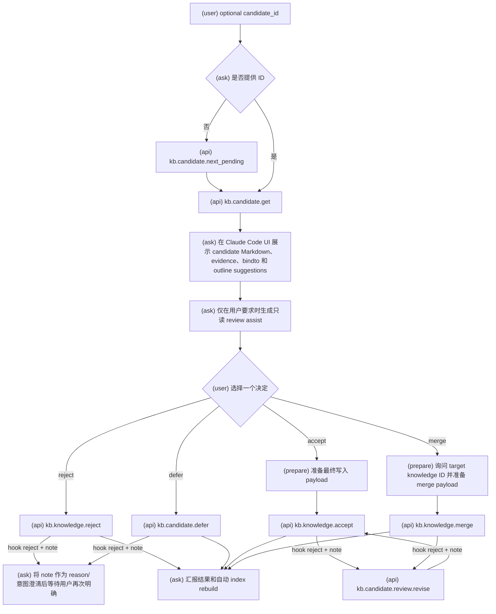
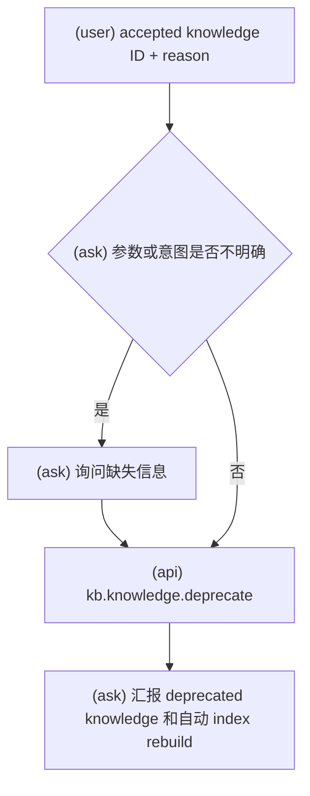

# KBManager Candidate 与 Knowledge 审核工作流

使用此 skill 时，必须明确告诉用户：`Using skill: kbm-candidate`。

执行具体 workflow 时，只读取该小节列出的 API reference。

API 调用硬规则：调用任何 `kb.*` API 前，必须先把 payload 写成 JSON object 文件，再把该文件路径传给 `scripts/kbmanager_plugin.py`；不得在命令行直接传 JSON 字符串。

此 skill 覆盖 candidate create/get/next pending/review，以及 accepted knowledge 的 merge/deprecate 等 review-gated 动作。

普通用户 workflow 中，不得修改 plugin 提供的 `SKILL.md`、`references/`、
`system-prompts/`、`src/kbmanager/`、`scripts/kbmanager_plugin.py` 或其他版本化资源。
只有用户明确要求进行 plugin 开发或维护时，才允许修改这些资源。

## Candidate 创建

本流程引用：

- `references/kb.candidate.create.md`

硬规则：调用任何 API 前，必须先读取本流程引用中对应的 references/ 文件确认输入载荷字段名，不得使用 result 输出字段名反推 payload。

### 意图流程图

- 仅在用户明确要求从已有 source IDs 创建 candidates 时调用。
- API 返回 `needs_llm` 时，生成 API 请求的结构化 candidate draft list，并用同一 resume token 恢复。
- 只创建 pending candidates，不创建 accepted knowledge。
- 没有 review gate，但可能返回 deprecated source warnings。

## Candidate 审核

当用户想要 accept、reject、defer、merge、approve、revise 或以其他方式 review pending candidate 时使用。

没有明确用户决定时，绝不 accept、reject、defer 或 merge。

本流程引用：

- `references/kb.candidate.next_pending.md`
- `references/kb.candidate.get.md`
- `references/kb.knowledge.reject.md`
- `references/kb.candidate.defer.md`
- `references/kb.knowledge.accept.md`
- `references/kb.knowledge.merge.md`

硬规则：调用任何 API 前，必须先读取本流程引用中对应的 references/ 文件确认输入载荷字段名，不得使用 result 输出字段名反推 payload。

### 意图流程图

1. 获取 candidate，或使用 next pending。
2. 默认不生成 LLM review assistance；只有用户明确要求解释、检查风险或辅助判断时，才生成只读 review assistance。review assistance 不是用户批准。
3. 在 Claude Code UI 中展示 candidate content、summary、evidence、bindto suggestions、outline suggestions 和可选决定。
4. 用户已经给出 accept、reject、defer 或 merge 决定时，不要再次要求 approve；准备对应最终写入 payload 并调用 API，PreToolUse hook 会负责展示和审批。
5. `accept`/`merge` 的 hook reject + note，或用户明确要求修改 accept/merge payload 时，调用 `kb.candidate.review.revise` 生成 revised payload，再重新调用最终写入 API 交给 hook 审批。
6. `reject`/`defer` 的 hook reject + note 不调用 revise；把 note 作为新的 reason 或意图澄清，等待用户再次明确 reject/defer，或停止流程。
7. 报告 accepted、rejected、deferred 或 merged 的 IDs、updated paths、warnings 和 next actions。

## Candidate 获取和下一个 Pending

本流程引用：

- `references/kb.candidate.next_pending.md`
- `references/kb.candidate.get.md`

- 对指定 candidate 使用 `kb.candidate.get`。
- 当用户要求“下一个”“继续审核”“next pending”“review queue”时，使用 `kb.candidate.next_pending`。
- 两者都是只读操作；展示 candidate content、summary、evidence、bindto、outline change suggestions 和 review state。
- 展示时不要把 index 内容当作事实；candidate object 是事实来源。

## 接受 Candidate

本流程引用：

- `references/kb.knowledge.accept.md`

- 使用 `kb.knowledge.accept`。
- 需要 reviewed title、summary、content、evidence 和 bindto。
- Evidence 必须来自 candidate 的 upstream source evidence。
- Bindto 必须引用存在的 knowledgebase、outline 和 node。
- 成功后 pending candidate 被 promote/move 为同 ID accepted knowledge；不要保留同 ID candidate。

## 拒绝 Candidate

本流程引用：

- `references/kb.knowledge.reject.md`

- 使用 `kb.knowledge.reject`。
- 需要明确 reject 用户决定，建议提供 reason。
- 成功后 candidate 移动到 rejected；不生成 accepted knowledge。

## 延后 Candidate

本流程引用：

- `references/kb.candidate.defer.md`

- 使用 `kb.candidate.defer`。
- 需要明确 defer 用户决定，建议提供 reason。
- 成功后 candidate 移动到 deferred；后续可由人工或未来 workflow 重新处理。

## 合并 Candidate 到 Knowledge

本流程引用：

- `references/kb.knowledge.merge.md`

- 使用 `kb.knowledge.merge`。
- 需要 pending candidate ID、accepted target knowledge ID 和明确 merge 用户决定。
- 需要 reviewed summary、content、evidence 和 bindto。
- 不使用单独的 merge LLM 草案；缺少 merge payload 时，基于 candidate 和 target knowledge 准备 payload，最终审批交给 PreToolUse hook。
- 成功后 target knowledge 更新，source candidate 以 rejected/merge review 记录保留审计。
- Merge 结果使用 target knowledge ID，不使用 candidate ID 作为正式 knowledge ID。

## 审核辅助规则

- Review assist 是只读辅助，只能帮助用户检查 summary、evidence、bindto、outline suggestions、风险和不确定点。
- 不要修改 KBManager object files。
- 不要代表用户做 accept、reject、defer、merge 或 deprecate 决策。
- 不要把 LLM 或 ask 建议表述为用户批准。
- 不要引入 candidate 或其引用对象中没有 evidence 支持的新事实。
- Suggested `bindto` 只是建议；最终 `bindto` 必须进入最终写入 payload，并由 PreToolUse hook 审批。
- 如果 candidate 包含 `outline_change_suggestions`，只说明影响；不要修改 knowledgebase outline，也不要把 outline 修改呈现为已批准。

## 废弃 Accepted Knowledge

本流程引用：

- `references/kb.knowledge.deprecate.md`

硬规则：调用任何 API 前，必须先读取本流程引用中对应的 references/ 文件确认输入载荷字段名，不得使用 result 输出字段名反推 payload。

### 意图流程图

- 使用 `kb.knowledge.deprecate`。
- 需要 accepted knowledge ID 和 reason；用户意图已经明确时不要额外要求一次确认。
- 不要删除 knowledge；deprecated knowledge 保留历史事实和引用链。
- 展示 deprecated knowledge 时明确标记过时或不推荐。

## Evidence 和 Bindto 规则

- Candidate 和 knowledge evidence 必须可追溯到 upstream source。
- Evidence item 必须包含 source/object ID、locator，以及 quote、excerpt 或 snippet。
- Notes、indexes、LLM suggestions 或用户未确认的草案不能作为 candidate evidence。
- `bindto` 表示 knowledge 归属和 outline node 绑定；没有合适绑定时使用空列表。
- `outline_change_suggestions` 只是建议，不自动修改 outline；需要 KB/outline workflow 单独处理。
