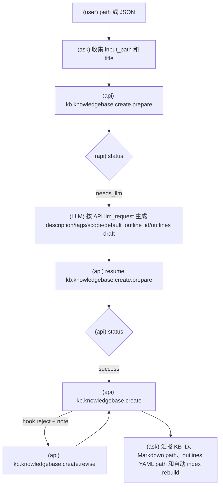
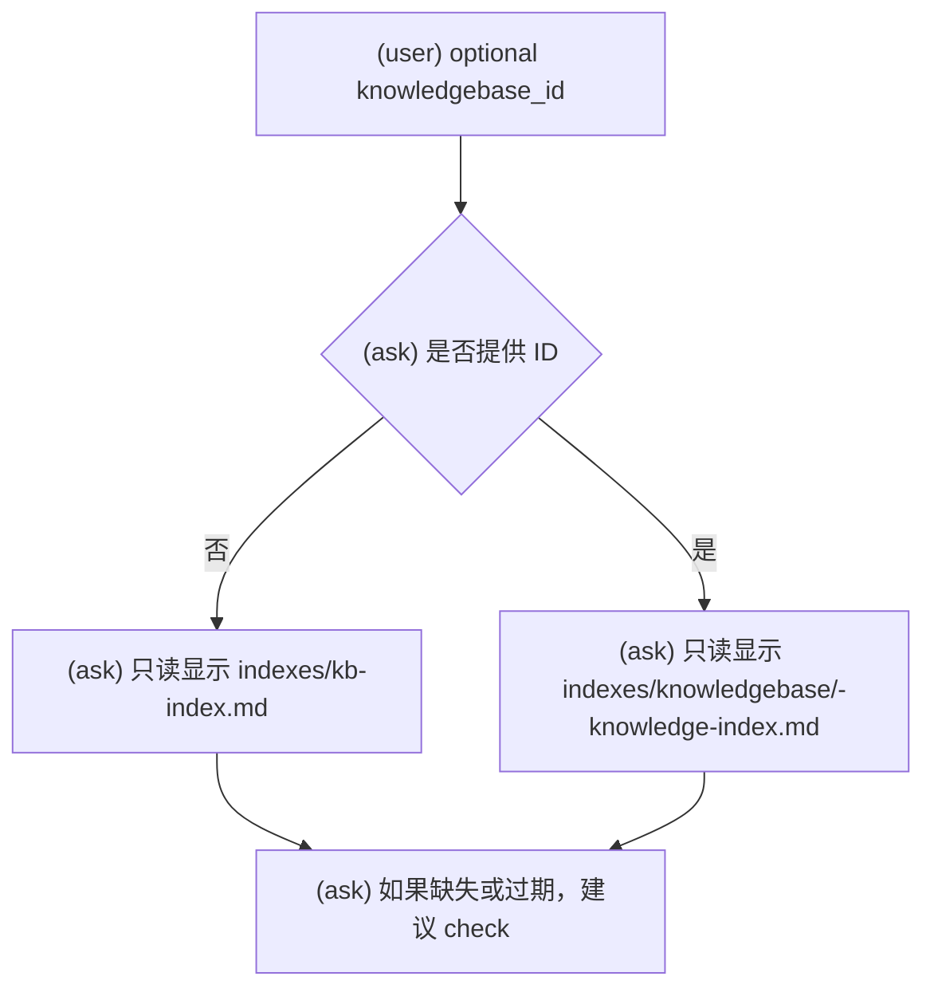
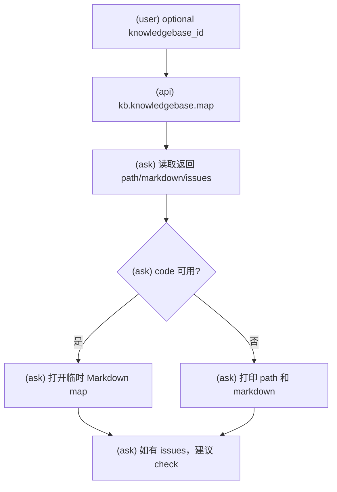
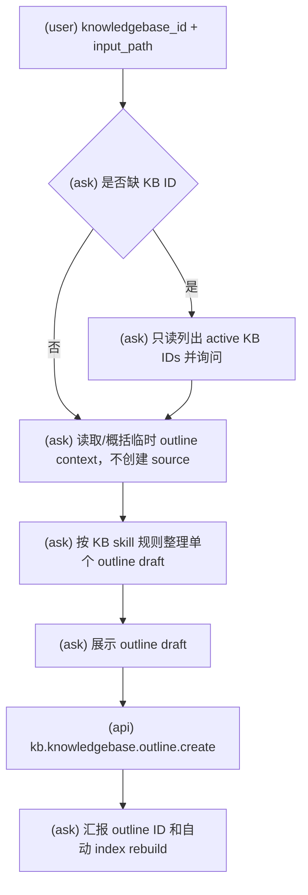
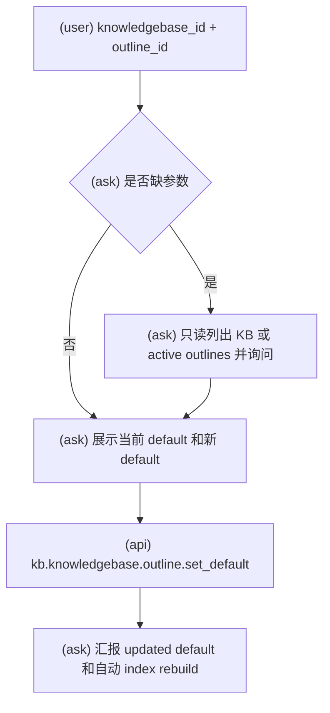
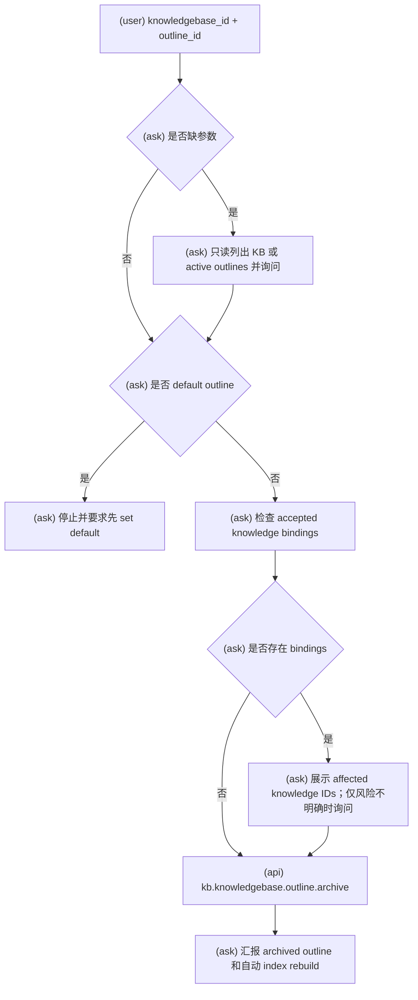

# KBManager Knowledgebase 与 Outline 工作流

使用此 skill 时，必须明确告诉用户：`Using skill: kbm-kb`。

执行具体 workflow 时，只读取该小节列出的 API reference。

API 调用硬规则：调用任何 `kb.*` API 前，必须先把 payload 写成 JSON object 文件，再把该文件路径传给 `scripts/kbmanager_plugin.py`；不得在命令行直接传 JSON 字符串。

此 skill 覆盖所有 KB 相关工作流：knowledgebase create/list/map，以及 outline create/set-default/archive 和用户明确要求时的 outline YAML 受控维护。

普通用户 workflow 中，不得修改 plugin 提供的 `SKILL.md`、`references/`、
`system-prompts/`、`src/kbmanager/`、`scripts/kbmanager_plugin.py` 或其他版本化资源。
只有用户明确要求进行 plugin 开发或维护时，才允许修改这些资源。

## Knowledgebase 创建

用于创建新的 active knowledgebase 和配套 outlines YAML。

本流程引用：

- `references/kb.knowledgebase.create.md`
- `references/kb.knowledgebase.create.prepare.md`
- `references/kb.knowledgebase.create.revise.md`

硬规则：调用任何 API 前，必须先读取本流程引用中对应的 references/ 文件确认输入载荷字段名，不得使用 result 输出字段名反推 payload。

### 意图流程图

1. 收集 title 和 source-like definition context。
2. 调用 `kb.knowledgebase.create.prepare`；返回 `needs_llm` 时按 `llm_request` 生成 draft，并用同一 resume token 恢复。
3. prepare 成功后，用返回的 payload 调用最终 `kb.knowledgebase.create`；不要额外展示一个最终 approve 节点，PreToolUse hook 会负责展示和审批。
4. hook approve 时执行最终创建；hook reject 无 note 时停止，不写对象。
5. hook reject + note 时，用当前 payload 和 note 调用 `kb.knowledgebase.create.revise`，得到 revised payload 后再次调用最终 `kb.knowledgebase.create` 交给 hook 审批。
6. 报告 knowledgebase ID、knowledgebase path、outlines file、created objects 和 next actions。

最终 `kb.knowledgebase.create` 会由 Claude Code PreToolUse hook 触发审批并展示最终写入请求；hook note 只回流到 revise，不表示原 API 已执行。

用户给出的 source、file 或 directory 只是临时定义上下文。此工作流不创建 source/candidate，不得调用 `kb.source.add`，不得调用 `kb.candidate.create`，不得写入 `data/raw` 或 `data/cleaned`，也不得把该 input 记录为 candidate/knowledge evidence。

## Knowledgebase 列表和查看

本流程引用：无。此流程只读读取 object files 或 derived indexes。

硬规则：调用任何 API 前，必须先读取本流程引用中对应的 references/ 文件确认输入载荷字段名，不得使用 result 输出字段名反推 payload。

### 意图流程图

- 可以只读读取 object files 或 derived indexes 用于展示。
- 不要将 index text 视为 factual evidence。
- 展示 deprecated、archived 或 inactive 状态时明确标记。
- List/view 不修改 objects，不运行 write APIs。

## Knowledgebase 映射

本流程引用：

- `references/kb.knowledgebase.map.md`

硬规则：调用任何 API 前，必须先读取本流程引用中对应的 references/ 文件确认输入载荷字段名，不得使用 result 输出字段名反推 payload。

### 意图流程图

- 使用 `kb.knowledgebase.map`。
- 可针对单个 knowledgebase ID，或省略 ID 生成全局 map。
- 该 API 生成临时 Mermaid map；不修改 object facts 或 repo-tracked indexes。
- 没有 review gate。
- 报告 map path、warnings、issues 和可展示的 markdown。

## Outline 创建

本流程引用：

- `references/kb.knowledgebase.outline.create.md`

硬规则：调用任何 API 前，必须先读取本流程引用中对应的 references/ 文件确认输入载荷字段名，不得使用 result 输出字段名反推 payload。

### 意图流程图

- 用于给 active knowledgebase 增加新 outline。
- 需要 knowledgebase ID 和 reviewed outline payload。
- 展示 outline title、description、nodes、scope fit 和 node ID 设计。
- 用户没有提出修改且意图仍是创建时，调用 `kb.knowledgebase.outline.create`；不要额外要求一次 approve，PreToolUse hook 会统一触发审批。
- 最终写入会由 Claude Code PreToolUse hook 触发审批。

## 设置默认 Outline

本流程引用：

- `references/kb.knowledgebase.outline.set_default.md`

硬规则：调用任何 API 前，必须先读取本流程引用中对应的 references/ 文件确认输入载荷字段名，不得使用 result 输出字段名反推 payload。

### 意图流程图

- 用于设置 active outline 为 knowledgebase default outline。
- 需要 knowledgebase ID 和 outline ID。
- 调用前确认目标 outline 存在且 active。
- 用户意图明确时调用 `kb.knowledgebase.outline.set_default`；不要额外要求一次 approve，PreToolUse hook 会统一触发审批。
- 最终写入会由 Claude Code PreToolUse hook 触发审批。

## Outline 归档

本流程引用：

- `references/kb.knowledgebase.outline.archive.md`

硬规则：调用任何 API 前，必须先读取本流程引用中对应的 references/ 文件确认输入载荷字段名，不得使用 result 输出字段名反推 payload。

### 意图流程图

- 用于 archive non-default outline。
- 需要 knowledgebase ID 和 outline ID。
- 归档前检查 binding risk：是否有 accepted knowledge 的 `bindto` 指向该 outline。
- 不能直接 archive default outline；必须先 set another default。
- 如果存在 bindings，除非用户明确接受风险或指定 repair plan，否则不要继续。
- 用户意图明确且风险已说明后调用 `kb.knowledgebase.outline.archive`；不要额外要求一次 approve，PreToolUse hook 会统一触发审批。
- 最终写入会由 Claude Code PreToolUse hook 触发审批。

## Outline YAML 直接编辑例外

本流程引用：无。此流程是受控 direct-edit exception，不是 `kb.*` API。

仅当用户明确要求编辑/更新/重排/重命名/移动/拆分/合并现有 outline YAML nodes 时使用。这是 LLM 辅助 outline 维护的受控直接编辑例外。

- 不要通过直接编辑创建新 outline；使用 `kb.knowledgebase.outline.create`。
- 不要通过直接编辑设置 default 或 archive；使用对应 API。
- 不要修改 knowledge、candidate、source、note、index 或 source files。
- 定位 knowledgebase Markdown 文件及其 `outlines_file`。
- 确认目标 `outline_id`。
- 搜索 accepted knowledge 中与该 knowledgebase 和 outline 匹配的 `bindto` entries。
- 只编辑目标 outline YAML nodes。
- 对 rename、move、reorder 和大多数 split/merge 情况，保留稳定 node IDs。
- 除非用户明确接受 binding repair，否则不要移除已绑定 node。
- 编辑后通过 `kb.index.rebuild` 或 `/kbm:ask` check workflow 验证。
- 报告 changed node IDs、preserved IDs、removed IDs、binding risks 和建议修复。

## Scope 和 Binding 规则

- Knowledgebase scope 用 `includes` 和 `excludes` 表示边界。
- Outline 是组织结构，不是 evidence。
- Knowledge 归属通过 knowledge object 的 `bindto` 表达，必须引用 kb ID、outline ID、node ID 和 reason。
- Outline change suggestions 不自动修改 outlines；必须走 outline workflow 或 direct-edit exception。
