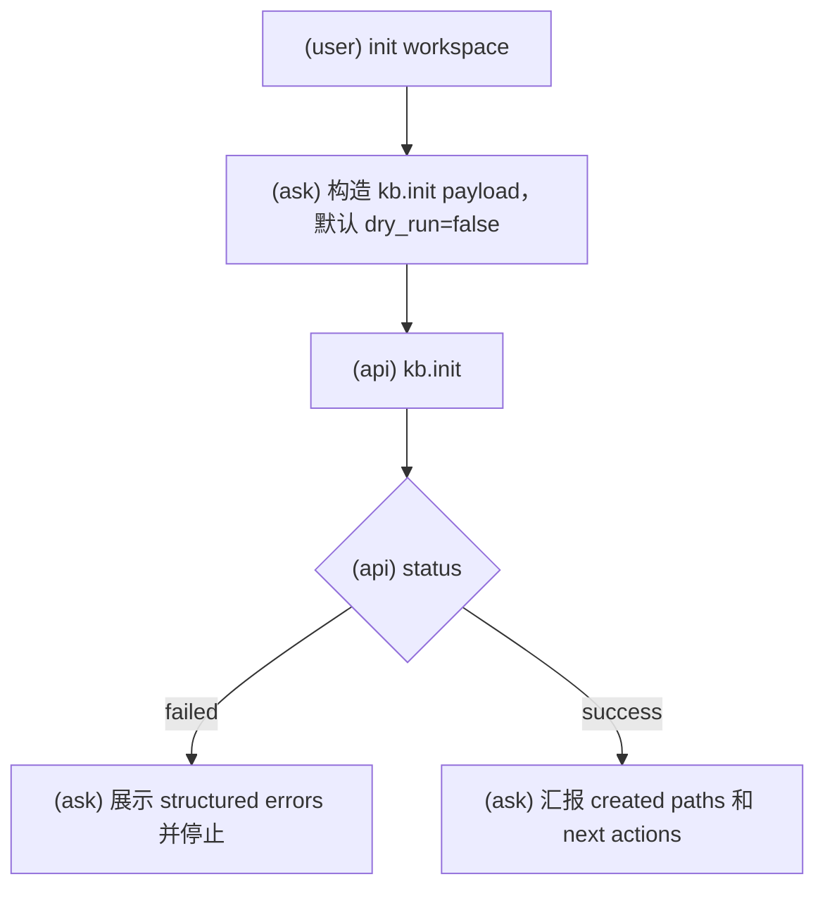
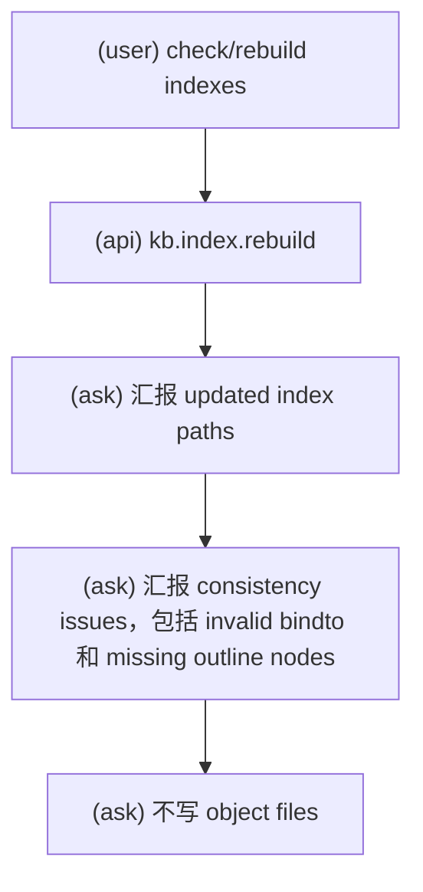
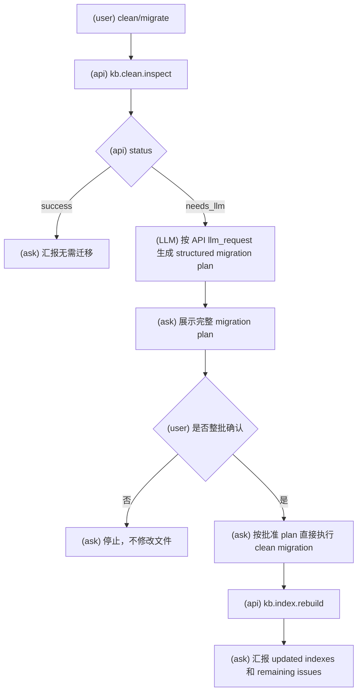

# KBManager Maintenance Workflows

使用此 skill 时，必须明确告诉用户：`Using skill: kbm-maintenance`。

执行此 skill 的任何工作流前，必须先阅读 `kbm-usage`。

此 skill 覆盖 init、check/index rebuild、clean inspect 和 clean migration execution。

## Init

### 意图流程图

- 使用 `kb.init` 初始化 workspace structure。
- Payload 包含 `entrypoint: "claude_code"` 和 `dry_run`。
- 没有 review gate。
- Dry run 报告将创建、保持不变或冲突的路径。
- 实际执行不得覆盖已有用户文件；初始化必须幂等。
- 报告 created structure、existing paths、conflicts、warnings 和 next actions。

## Check And Index Rebuild

### 意图流程图

- 使用 `kb.index.rebuild`。
- 将该操作视为 consistency checking 和 derived index rebuilding。
- 可使用 `scope` 和 `object_id` 限定范围。
- `dry_run: true` 报告 planned index diffs 和 consistency issues。
- `dry_run: false` 从 object files 重建 derived indexes。
- 除非用户请求单独 reviewed workflow，否则不要自动修复 object files。

## Clean Inspect And Migration

### 意图流程图

- 使用 `kb.clean.inspect` 执行只读 layout/schema inspection。
- 没有 review gate。
- 不直接修改 object files。
- 如果无差异，报告不需要 migration plan。
- 如果有差异，API 可返回 `needs_llm` 生成 clean migration plan。
- 报告 differences、warnings、migration_required 和 next actions。
- 只有在完整 migration plan 已展示在 Claude Code UI 且用户明确批准后，才可以执行。
- Clean migration execution 是 `kbm-usage` 定义的受控 direct-edit exception。
- 执行时严格按 approved plan 修改，不夹带无关重构。
- 不物理删除业务对象，除非 approved plan 明确处理非对象临时/派生产物且不会破坏引用链。
- 执行后运行 `kb.index.rebuild` 或等价 check，报告 changed paths、remaining issues 和 warnings。

## Boundaries

- Maintenance workflows 负责结构、一致性、索引和迁移，不负责普通 source/candidate/knowledge/note/KB 内容编辑。
- Indexes 是派生文件；不要把 index 内容作为事实写回 objects。
- Clean inspect 的 LLM plan 不是用户批准；必须再收集明确 approval。
