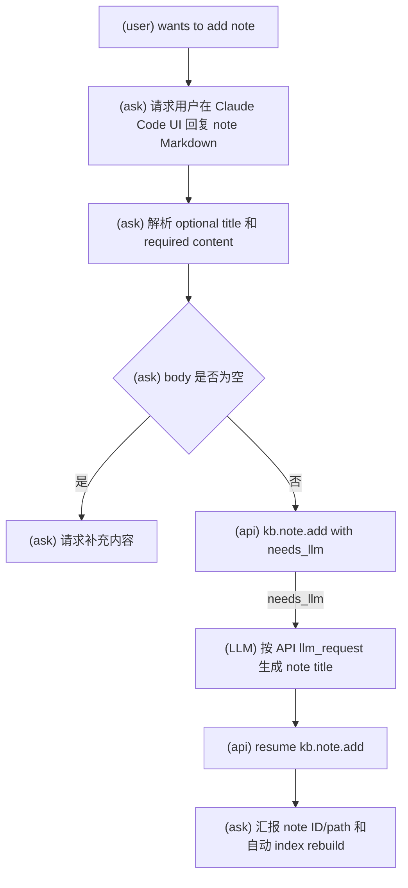
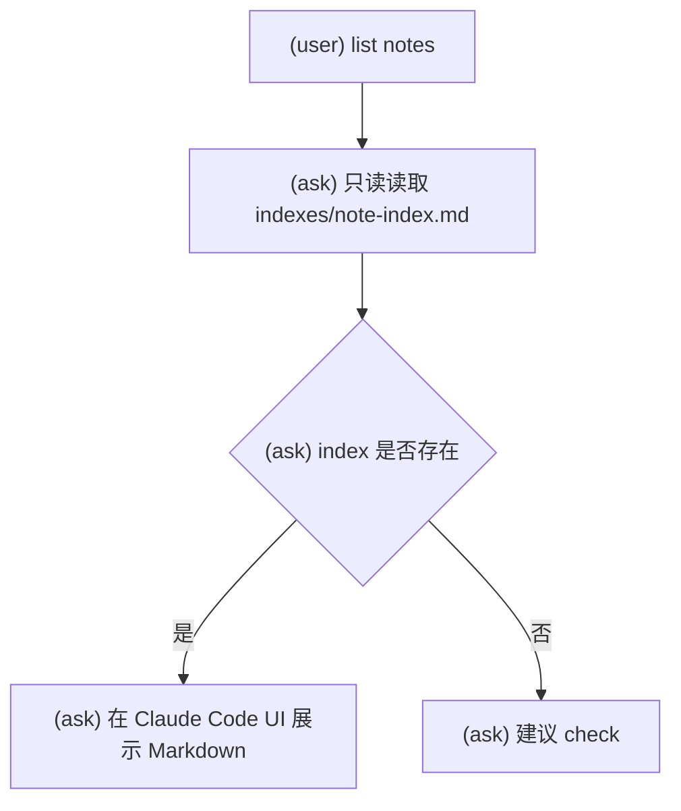
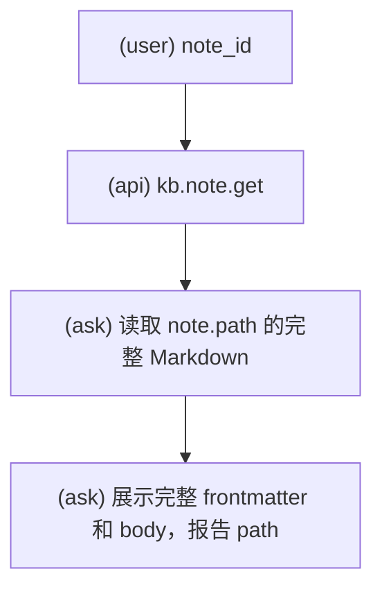
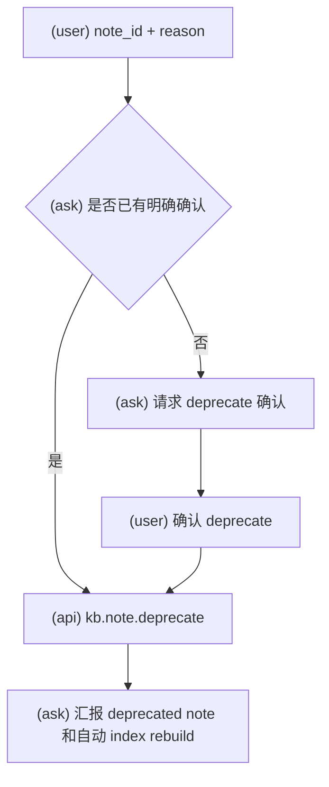

# KBManager Note 工作流

使用此 skill 时，必须明确告诉用户：`Using skill: kbm-note`。

执行具体 workflow 时，只读取该小节列出的 API reference。

此 skill 覆盖 note add、title generation、get/list/view 和 deprecate。

## Note 添加

本流程引用：

- `references/kb.note.add.md`

### 意图流程图

1. 从用户请求、当前消息或明确输入中收集 note content。
2. 如果用户提供非空 title，使用该 title 调用 `kb.note.add`。
3. 如果用户没有提供 title，可以用 `needs_llm: true` 调用 `kb.note.add`，按 API 请求生成非空 title，再用同一 resume token 恢复。
4. 报告 note ID、created path、title、warnings 和 next actions。

Note add 没有 review gate。不要把 note content 改写成 source、candidate 或 knowledge，除非用户另行发起对应 workflow。

## Note 列表

本流程引用：无。此流程只读读取 `indexes/note-index.md`。

### 意图流程图

- List display 可以只读读取 note index，仅用于展示和定位。
- 展示 deprecated notes 时标记为 deprecated/outdated。
- 不要将 note index 当作 candidate creation evidence。

## Note 查看

本流程引用：

- `references/kb.note.get.md`

### 意图流程图

- 对指定 note 使用 `kb.note.get`。
- 展示完整 Markdown file content，包括 frontmatter 和 body。
- 不要用 summary 替代 note body。
- 不要编辑 note files。

## Note 废弃

本流程引用：

- `references/kb.note.deprecate.md`

### 意图流程图

1. 获取 note ID 和非空 reason。
2. 在 Claude Code UI 中展示将废弃的 note 和影响。
3. 收集明确 `deprecate` decision。
4. 调用 `kb.note.deprecate`。
5. 报告 deprecated note ID、path、diffs、warnings 和 next actions。

Note deprecate 需要 review gate。不要物理删除 note。

## 边界

- Notes 是个人记录，不是 source lifecycle input。
- 从 note 生成 candidate 或 knowledge 不属于当前实现；如用户想把笔记变成知识，必须先明确转换策略，不能直接把 note 当 evidence。
- Deprecated notes 默认应标记为过时，不作为推荐材料展示。
